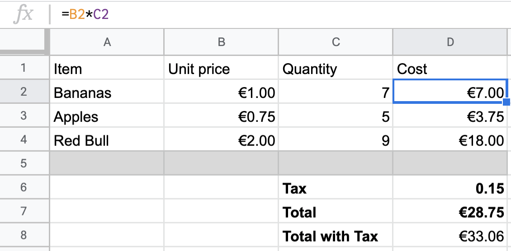
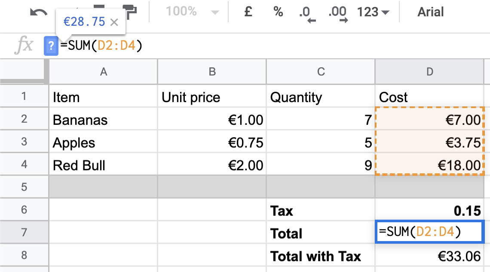

build-lists: true
theme: Ostrich, 3
slide-transition: true
slidenumbers: true
footer: `💻 github.com/ChrisPenner/comonads-by-example | 🐦 @ChrisLPenner | 📝 chrispenner.ca`

^ background-color: #0F0E0E
^ text: #FF5481
^ header: #FF5481
^ text-emphasis: #FFFFFF
^ text-strong: #FF5481
^ code: auto(25)

#[fit] Comonad **Fix**!
### _for when your comonads are broken_

---

#[fit]Given the **answer**
#[fit]compute the **answer**

####seriously Haskell WTF?

---

#[fit] Like 
#[fit] **Spreadsheets**

---

#[fit]`wfix :: w (w a -> a) -> a `

---

##[fit] Given a **comonad**
##[fit] Filled with 
##[fit]**queries over the final result**

---

##[fit] resolve them all **using** the result
##[fit] to **get** the result

---


---

# Factorial

```haskell
> factorial 3 
3 * 2 * 1
6
```

---

# Factorial

```haskell
-- The FUNCTION is the context 
-- which we can use in the computation
let fact 0 = 1
    fact n = n * fact (n -1)
                 ^^^^
> fact 3
6
```

---

#[fit] Note how `fact 0 = 1`
#[fit] **DOESN'T** reference the **context**
###_a.k.a. it doesn't recurse_

---

#[fit] Each layer needs access
#[fit] To a **nearby** answer

---

# Factorial

[.code-highlight: 4]
[.code-highlight: all]
```haskell
factorialTraced :: Traced (Sum Int) Int
factorialTraced = extend wfix (traced go)
  where
    go :: Sum Int -> Traced (Sum Int) Int -> Int
    go (Sum 0) _ = 1
    go (Sum n) t = n * trace (-1) t
```

---


# Example: Dependency Tracking

```haskell
ingredientsOf :: String -> S.Set String
ingredientsOf "string" = S.fromList ["wool"]
ingredientsOf "sticks"  = S.fromList ["wood"]
ingredientsOf "bow"    = S.fromList ["sticks", "string"]
ingredientsOf "arrows"  = S.fromList ["sticks", "feathers", "stone"]
ingredientsOf "quiver" = S.fromList ["arrows", "bow"]
ingredientsOf "torches"  = S.fromList ["coal", "sticks"]
ingredientsOf _        = mempty

recipes :: Store (S.Set String) (S.Set String)
recipes = store (foldMap ingredientsOf) mempty
```

---

```haskell
string  -> wool
sticks  -> wood
bow     -> sticks, string
arrow   -> sticks, feather, stone
quiver  -> arrow, bow
torches -> coal, sticks
```

```haskell
λ> peek ["string"] recipes
fromList ["wool"]
λ> peek ["string", "torches"] recipes
fromList ["coal","sticks","wool"]
λ> extract $ recipes =>> peek ["torches"]
fromList ["coal","sticks"]
```

---

```haskell
string  -> wool
sticks  -> wood
bow     -> sticks, string
arrow   -> sticks, feather, stone
quiver  -> arrow, bow
torches -> coal, sticks
```

---


---


---

[.code-highlight: 1-2]
[.code-highlight: 4]
[.code-highlight: 7-9]
[.code-highlight: 5]
[.code-highlight: all]
```haskell
recipes :: Store (S.Set String) (S.Set String)
recipes = store (foldMap ingredientsOf) mempty

allDeps :: Store (S.Set String) (S.Set String)
allDeps = extend wfix (go <$> recipes)
  where
    go :: S.Set String -> Store (S.Set String) (S.Set String) -> (S.Set String)
    go deps _    | S.null deps = mempty
    go deps result             = deps <> peek deps rec
```

---

[.code-highlight: 1-6]
[.code-highlight: 1-9]
[.code-highlight: 1-12]
[.code-highlight: all]
```haskell
string  -> wool
sticks  -> wood
bow     -> sticks, string
arrow   -> sticks, feather, stone
quiver  -> arrow, bow
torches -> coal, sticks

λ> peek ["arrows"]  allDeps
fromList ["feathers","sticks","stone","wood"]

λ> peek ["arrows", "torches"]  allDeps
fromList ["coal","feathers","sticks","stone","wood"]

λ> peek ["quiver"]  allDeps
fromList ["arrows","bow","feathers","sticks","stone","string","wood","wool"]
```


---

# Spreadsheets


---

# Spreadsheets


---

# Formulas



---

# Formulas


---

# Formulas



---

```haskell
dataDef :: (Char, Int) -> Double
dataDef ('B', 2) = 1
dataDef ('B', 3) = 0.75
dataDef ('B', 4) = 2

dataDef ('C', 2) = 7
dataDef ('C', 3) = 5
dataDef ('C', 4) = 9

dataDef2 ('D',  row) = ???

dataDef _ = 0
```


---


```haskell
sheet :: Store (Char, Int) Double
sheet = (store (dataDef . first toUpper ) ('A', 1))

λ> peek ('B', 2) sheet
1.0

λ> peek ('B', 4) sheet
2.0

λ> peek ('C', 4) sheet
9.0
```


---

```haskell
dataDef2 :: (Char, Int) 
         -> Store (Char, Int) Double 
         ->  Double

-- B and C are the same; we ignore the new input...

dataDef2 ('D',  row) w | row < 6 =
  let price = peek ('B', row) w
      quant = peek ('C', row) w
   in price * quant
```


---

[.code-highlight: 1-2]
[.code-highlight: 4-5]
[.code-highlight: 6-7]
[.code-highlight: 8-12]
[.code-highlight: all]

```haskell
getCells :: Functor f => f s -> Store s a -> f a
getCells cells w = experiment (const cells) w

-- Tax
dataDef2 ('D', 6) _ = 0.15
-- Total
dataDef2 ('D', 7) w = sum . getCells (('D',) <$> [1..5]) $ w
-- Total With Tax
dataDef2 ('D', 8) w =
    let tax = peek ('D', 6) w
        total = peek ('D', 7) w
     in (tax * total) + total
```
