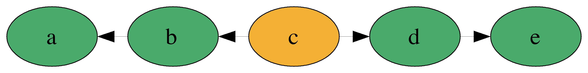

#[fit] Comonads
#[fit] __comonoids in the category of endofunctors__
#[fit] __what's the problem?__

---

#[fit] Monads

---

#[fit] Co-monads

---

#[fit] Duals

---

# What the heck

Comonads help to write programs which concern *values* and their *surroundings*.

Monads typically manipulate *__EFFECTS__*

*Co*monads typically manipulate *__DATA__*

Let's start by thinking of some data-types where values have a *context*

---

# Trees

---

# Non-Empty Lists

---

# Zipper

---

# Usage Examples

---

List

---

# Tree

---

---

# Duplicate

---

# Summary

| Monad | Comonads |
| --- | --- | --- |
| Manipulate *EFFECTS* | Manipulate *DATA* | 
| do-notation | function composition |
| opaque | inspectable |
| can be *empty* | must have a value |

---

1.  Overview
    -   A high level discussion of what comonads are good for including shallow
        descriptions of a few motivating examples (Zippers, Streams, Conway's
        game of life aka cellular automata, analyzing subtrees, etc)
    -   Explore how the methods of the Comonad typeclass accomplish these
        behaviours and implement some trivial comonads to solve a few simple
        problems (e.g. Identity, Env, NonEmpty list)
2.  Solving problems with 'extend'
    -   Implement the List Zipper comonad together and solve the 'trapped
        rainwater' google interview problem problem using 'extend'.
3.  Store Comonads
    -   Intro to the Store comonad, using pos and seek.
    -   Implement Newton's method to solve square roots using the Store Comonad
4.  Grid-based Comonads, exploring context using 'experiment'
    -   Quick intro to representable functors and
        Control.Comonad.Representable.Store
    -   Implement Cellular Automata via Conway's game of life simulation using
        experiment
    -   Quick exploration of electricity and water flow simulations using
        similar techniques
5.  Image processing using Comonads
    -   Matrices as Representable Store Comonads
    -   Implement a simple sliding window 'Blur' using extend and experiment.
    -   Explore more complex image processing algorithms, e.g. edge detection,
        median colour selection, etc.

Bonus topics:

Day Convolution, Comonads as UIs, Comonads for fluid/electricity flow
simulation, comonads in video games, tree computations using CoFree, and
anything people ask about.
