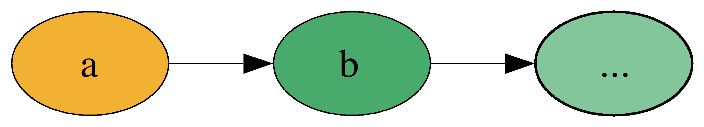

build-lists: true
theme: Ostrich, 3

^ background-color: #0F0E0E
^ text: #FF5481
^ header: #FF5481
^ text-emphasis: #FFFFFF
^ text-strong: #FF5481
^ code: auto(25)

#[fit] **Comonads**
#[fit] *comonoids in the category of endofunctors*
#[fit] *what's the problem?*

^ Add an additional tree example (with a different solution) and show how comonad generalizes both
^ Live code the actual comonad instance for Tree and use it to solve the problem

---

#[fit] Monads


---

#[fit] Co-monads


---

Comonads represent **SPACES** with a **reference point**

---

# Non-Empty Lists


---

# Trees


---

# Spreadsheets


---

# Zipper


---

# Functions


---

# Grids


---

# Stream

```haskell
data Stream a = a :> Stream a
    deriving Functor

```

---



---


```haskell
instance Comonad w where
  extract   :: w a -> a
  duplicate :: w a -> w (w a)
  -- (=>>)  :: w a -> (w a -> b) ->  w b
  extend    :: (w a -> b) -> w a -> w b
{-# MINIMAL extract, (duplicate | extend) #-}

instance Monad m where
  return  :: a -> m a
  join    :: m (m a) -> m a
  (>>=)   :: m a -> (a -> m b) ->  m b
  -- bind :: (a -> m b) -> m a -> m b
```

---

```haskell
extract :: w a -> a
return  :: a   -> m a
```

---

```haskell
duplicate :: w a     -> w (w a)
join      :: m (m a) -> m a
```

---

```haskell
(=>>) :: w a -> (w a -> b) ->  w b
(>>=) :: m a -> (a -> m b) ->  m b

extend  :: (w a -> b) -> w a -> w b
bind    :: (a -> m b) -> m a -> m b
```

---

```haskell
instance Comonad Stream where
  extract :: Stream a -> a
  duplicate :: Stream a -> Stream (Stream a)
  extend :: (Stream a -> b) -> Stream a -> Stream b
```

---

# Laws!

```
extend extract      = id
extract . extend f  = f
extend f . extend g = extend (f . extend g)
```

---

```haskell
extend  :: (w a -> b) -> w a -> w b
extend f = fmap f . duplicate

extend extract = id
=
fmap extract . duplicate = id
```

---

```haskell
instance Comonad Stream where
  extract :: Stream a -> a
  extract (a :> _) = a

  duplicate :: Stream a -> Stream (Stream a)
  duplicate s@(_ :> rest) = s :> duplicate rest

  extend :: (Stream a -> b) -> Stream a -> Stream b
  extend f s@(_ :> rest) = f s :> extend f rest
```

---

# ix 1


---


```haskell
ix :: Int -> Stream a -> a
ix n _ | n < 0 = error "don't do that silly"
ix 0 (a :> _) = a
ix n (_ :> rest) = ix (n - 1) rest
```

---

# drop 1 (a.k.a. tail)


---

```haskell
dropS :: Int -> Stream a -> Stream a
```

---

```haskell
dropS :: Int -> Stream a -> Stream a

ix :: Int -> Stream a -> a

---

extract :: Stream a -> a
duplicate :: Stream a -> Stream (Stream a)
extend :: (Stream a -> b) -> Stream a -> Stream b
```

---

```haskell
dropS :: Int -> Stream a -> Stream a

ix    :: Int -> Stream a -> a

extend :: (Stream a -> b) -> Stream a -> Stream b
```

---

```haskell
-- ix    :: Int -> Stream a -> a
-- extend :: (Stream a -> b) -> Stream a -> Stream b

dropS :: Int -> Stream a -> Stream a
dropS n = extend (ix n)
```

---

# Duplicate


^ Talk about Duplicate/Extract law

---

```haskell
takeS :: Int -> Stream a -> [a]
takeS n _ | n < 0 = error "don't do that silly"
takeS 0 _ = []
takeS n (a :> rest) = a : takeS (n - 1) rest
```

---

```haskell
fromList :: [a] -> Stream a
fromList xs = go (cycle xs)
  where
    go [] = error "don't do that silly"
    go (a:rest) = a :> go rest
```

---


```haskell
-- takeS :: Int -> Stream a -> [a]
-- extend :: (Stream a -> b) -> Stream a -> Stream b

---

windows :: Int -> Stream a -> Stream [a]
windows n = extend (takeS n)
```

---


```haskell
rollingAvg :: Int -> Stream Int -> Stream Double
rollingAvg windowSize = extend (avg . takeS windowSize)
  where
    avg :: [Int] -> Double
    avg xs =
          fromIntegral (sum xs)
        / fromIntegral (length xs)
```

---


---

#[fit]**_BYOZ_**

Build Your Own Zipper

---

```haskell
data Zipper a =
  Zipper
    { left :: [a]
    , focus :: a
    , right :: [a]
    }
```

---


---


---

## Implement Comonad For Zipper

```haskell
instance Comonad Zipper where
  extract :: Zipper a -> a
  duplicate :: Zipper a -> Zipper (Zipper a)
  extend :: (Zipper a -> b) -> Zipper a -> Zipper b
```

---

# Rainwater Problem

---


---

```
    #    
    # o #  
# o # # # # o #
# o # # # # # #
- - - - - - - -
2 0 4 2 3 2 1 2
```
---

#[fit] **LIVE CODE IT**

### *what could possibly go wrong?*

---


```haskell
problem :: Zipper Int
problem = fromList [2, 0, 4, 2, 3, 2, 1, 2]

waterAtPosition :: Zipper Int -> Int
waterAtPosition (Zipper toLeft current toRight) = max 0 (min maxLeft maxRight - current)
  where
    maxLeft  = maximum (0 : toLeft)
    maxRight = maximum (0 : toRight)

solution :: Zipper Int -> Int
solution = sum . extend waterAtPosition
```

---


---

#[fit] _Zippers_


---


---


THE END 

---


---

# Grids


---


---


---


---


#[fit] Comonads as Objects
### (a'la Gabriel Gonzalez)

---


---

CLI History

---


---


---

# ...

---

```haskell
  value :: Tree a -> a

  duplicateTree :: Tree a -> Tree (Tree a)

  mapSubtrees :: (Tree a -> b) -> Tree a -> Tree b
```

---

```haskell
  extract :: Tree a -> a

  duplicate :: Tree a -> Tree (Tree a)

  extend :: (Tree a -> b) -> Tree a -> Tree b
```

---

```haskell
class Functor w => Comonad w where
  extract :: w a -> a

  duplicate :: w a -> w (w a)

  extend :: (w a -> b) -> w a -> w b
```

---

```haskell
class Functor w => Comonad w where
  extract :: w a -> a

  duplicate :: w a -> w (w a)

  extend :: (w a -> b) -> w a -> w b
```

```haskell
class Applicative m => Monad m where
  return :: a -> m a

  join :: m (m a) -> m a

  bind :: m a -> (a -> m b) -> m b
```

---

```haskell
  extract :: w a ->   a
    vs
  return  ::   a -> m a

```

---
```haskell
  duplicate ::    w a  -> w (w a)
   vs
  join      :: m (m a) ->    m a
```

---

```haskell
  extend :: (w a -> b) -> w a -> w b
   vs
  bind   :: m a -> (a -> m b) -> m b
```


---

# **Summary**

| **Monads** | **Comonads** |
| --- | --- | --- |
| Manipulate *EFFECTS* | Manipulate *DATA* | 
| do-notation | function composition |
| opaque | inspectable |
| can be *empty* | must have a value |

---

#[fit] Spreadsheets

---


---
