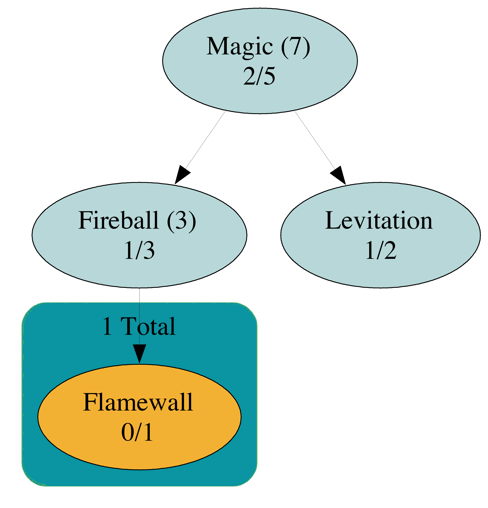
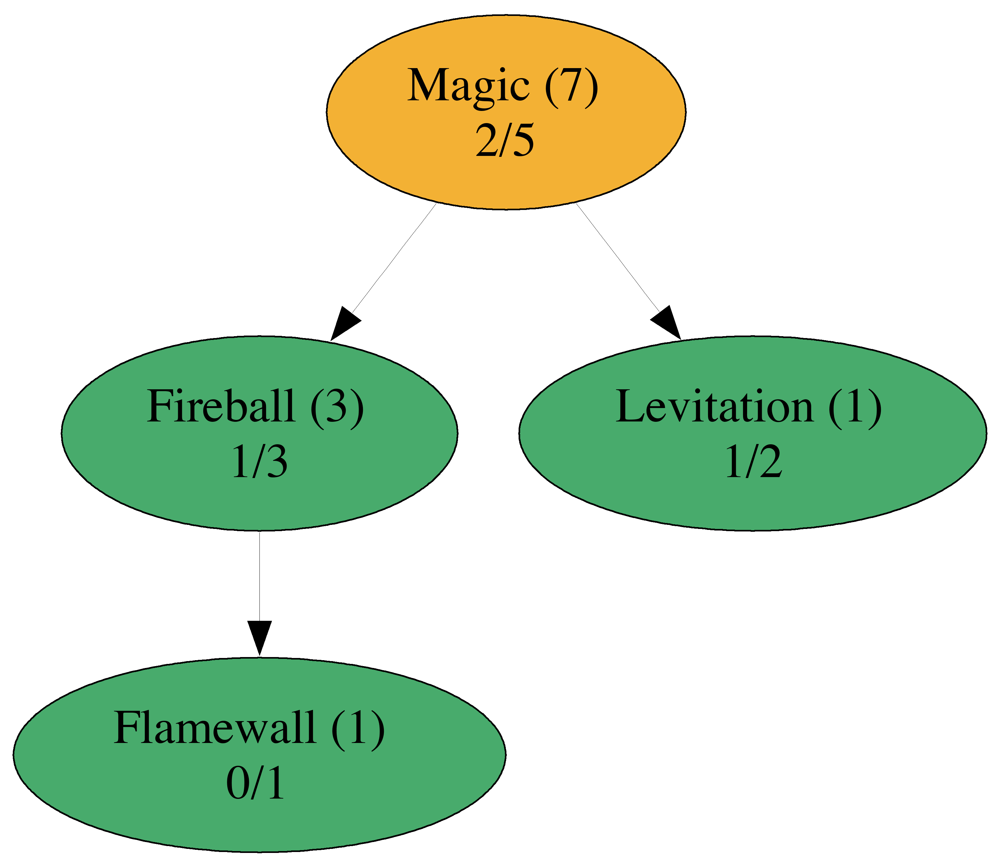

build-lists: true
theme: Ostrich, 3

^ background-color: #0F0E0E
^ text: #FF5481
^ header: #FF5481
^ text-emphasis: #FFFFFF
^ text-strong: #FF5481
^ code: auto(25)

#[fit] **Comonads**
#[fit] *comonoids in the category of endofunctors*
#[fit] *what's the problem?*

---

#[fit] Monads


---

#[fit] Co-monads


---

#[fit] Duals


---

Comonads help to write programs which concern **values** and their **surroundings**.

---

Monads typically manipulate **EFFECTS**

**Co**monads typically manipulate **DATA**

---

# [fit] Simulation


---

# [fit] Hill climbing


---

# [fit] Image processing


---

# [fit] Spreadsheets


---

# [fit] Statistics


---

__context__ual datatypes


---

# Non-Empty Lists


---

# Trees


---

# Spreadsheets


---

# Zipper


---

# Functions


---

# Skill Trees


---


---


---


---


---



---



---


---

#[fit] **LIVE CODE IT**

### *what could possibly go wrong?*

---

# ...

---

```haskell
  value :: Tree a -> a

  duplicateTree :: Tree a -> Tree (Tree a)

  mapSubtrees :: (Tree a -> b) -> Tree a -> Tree b
```

---

```haskell
  extract :: Tree a -> a

  duplicate :: Tree a -> Tree (Tree a)

  extend :: (Tree a -> b) -> Tree a -> Tree b
```

---

```haskell
class Functor w => Comonad w where
  extract :: w a -> a

  duplicate :: w a -> w (w a)

  extend :: (w a -> b) -> w a -> w b
```

---

```haskell
class Functor w => Comonad w where
  extract :: w a -> a

  duplicate :: w a -> w (w a)

  extend :: (w a -> b) -> w a -> w b
```

```haskell
class Applicative m => Monad m where
  return :: a -> m a

  join :: m (m a) -> m a

  bind :: m a -> (a -> m b) -> m b
```

---

```haskell
  extract :: w a ->   a
    vs
  return  ::   a -> m a

```

---
```haskell
  duplicate ::    w a  -> w (w a)
   vs
  join      :: m (m a) ->    m a
```

---

```haskell
  extend :: (w a -> b) -> w a -> w b
   vs
  bind   :: m a -> (a -> m b) -> m b
```

---


---

# Derivatives

---


---


---


---


---


---


---

#[fit] Spreadsheets

---


---


---


---
---
---

---


---


---

```haskell
data Tetromino = Ricky | Island | Hero | Teewee | Smashboy
    deriving (Eq, Show)

upNext :: [Tetromino]
upNext = Ricky : Smashboy : Hero : Teewee : []
```

---


---

```haskell
distanceToHero :: [Tetromino] -> Maybe Int
distanceToHero = findIndex (== Hero)

tagDistances :: [Tetromino] -> [(Tetromino, Maybe Int)]
tagDistances [] = []
tagDistances xs@(x:rest) = (x, distanceToHero xs) : pairDistances rest
```

---

#[fit] Avoiding explicit recursion
####__(most of the time)__

---

```haskell
tagDistances :: [Tetromino] -> [(Tetromino, Maybe Int)]
tagDistances [] = []
tagDistances xs@(x:rest) 
    = (x, distanceToHero xs) : pairDistances rest
```

---

```haskell
tagDistances xs@(x:rest) 
    = go (x, distanceToHero xs) : tagDistances rest
  where
    go xs = head xs
```

---

```haskell
duplicate :: [a] -> [[a]]
duplicate [] = []
duplicate xs@(_:rest) = xs : duplicate rest

> duplicate [1, 2, 3]
[ [1, 2, 3]
, [2, 3]
, [3]
]
```

---


List


---

List


---

```haskell
duplicate :: [a] -> [[a]]

balloon :: ([a] -> b) -> [a] -> [b]
balloon f = fmap f . duplicate'

pairDistances'' :: [Tetromino] -> [(Tetromino, Maybe Int)]
pairDistances'' = balloon pair
  where
    pair :: [Tetromino] -> (Tetromino, Maybe Int)
    pair xs = (head xs, distanceToHero xs)
```

---

# Tree


---


---


---

#  $$ \sqrt{ 16 } $$

---

$$ x = \sqrt{ 16 } $$

$$ x^2 = (\sqrt{ 16 })^2 $$

$$ x^2 = 16 $$

$$ x^2 - 16 = 0 $$

---

# Duplicate


---

# Summary

| Monad | Comonads |
| --- | --- | --- |
| Manipulate *EFFECTS* | Manipulate *DATA* | 
| do-notation | function composition |
| opaque | inspectable |
| can be *empty* | must have a value |

---

1.  Overview
    -   A high level discussion of what comonads are good for including shallow
        descriptions of a few motivating examples (Zippers, Streams, Conway's
        game of life aka cellular automata, analyzing subtrees, etc)
    -   Explore how the methods of the Comonad typeclass accomplish these
        behaviours and implement some trivial comonads to solve a few simple
        problems (e.g. Identity, Env, NonEmpty list)

--- 

2.  Solving problems with 'extend'
    -   Implement the List Zipper comonad together and solve the 'trapped
        rainwater' google interview problem problem using 'extend'.

---

3.  Store Comonads
    -   Intro to the Store comonad, using pos and seek.
    -   Implement Newton's method to solve square roots using the Store Comonad

---

4.  Grid-based Comonads, exploring context using 'experiment'
    -   Quick intro to representable functors and
        Control.Comonad.Representable.Store
    -   Implement Cellular Automata via Conway's game of life simulation using
        experiment
    -   Quick exploration of electricity and water flow simulations using
        similar techniques
---

5.  Image processing using Comonads
    -   Matrices as Representable Store Comonads
    -   Implement a simple sliding window 'Blur' using extend and experiment.
    -   Explore more complex image processing algorithms, e.g. edge detection,
        median colour selection, etc.


---

Bonus topics:

Day Convolution, Comonads as UIs, Comonads for fluid/electricity flow
simulation, comonads in video games, tree computations using CoFree, and
anything people ask about.


