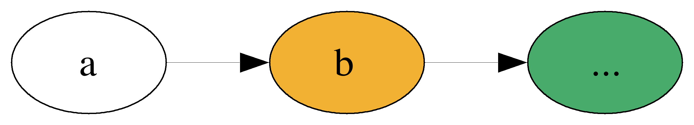
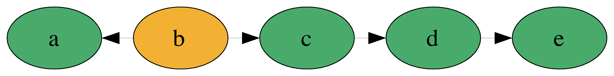
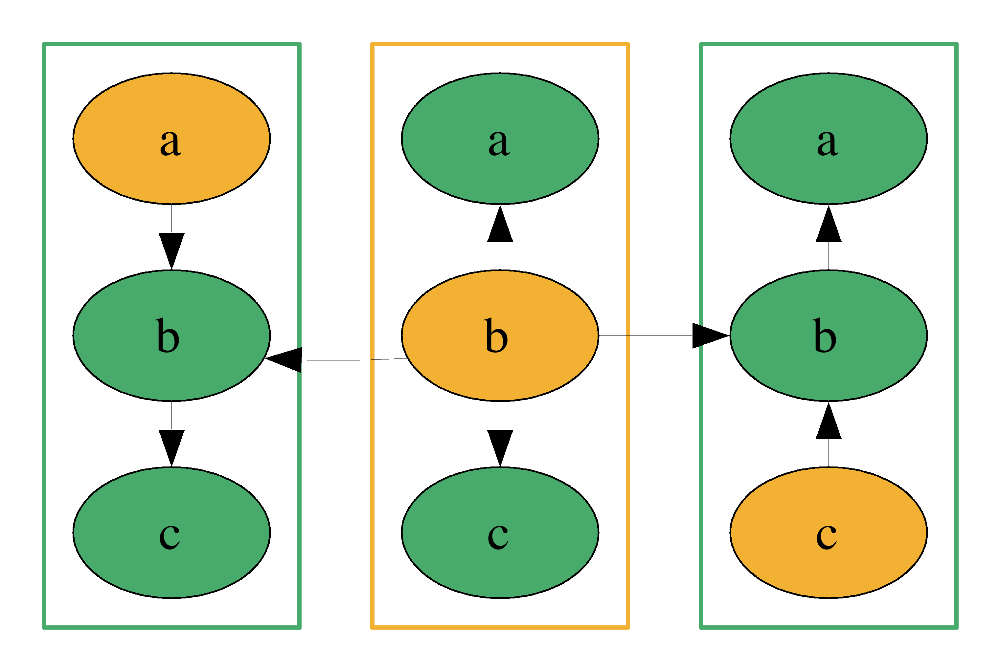

build-lists: true
theme: Ostrich, 3

^ background-color: #0F0E0E
^ text: #FF5481
^ header: #FF5481
^ text-emphasis: #FFFFFF
^ text-strong: #FF5481
^ code: auto(25)

#[fit] **Comonads**
#[fit] *comonoids in the category of endofunctors*
#[fit] *what's the problem?*

---

# Outline

- Slides
- Examples
- Implementations
- Live Coding
- DIY

---

# Get the SRC

TODO: LINKY

---

#[fit] Monads


---

#[fit] Co-monads


---

# [fit]DUALS

---

## What are they?

Comonads represent **SPACES** with a **reference point**

---

# Non-Empty Lists


---

# Trees


---

# Spreadsheets


---

# Zipper


---

# Functions


---

# Stream

```haskell
data Stream a = a :> Stream a
    deriving (Functor, Foldable)

```

```haskell
fromList :: [a] -> Stream a
fromList xs = go (cycle xs)
  where
    go [] = error "don't do that silly"
    go (a:rest) = a :> go rest
```


---

```haskell
'a' :> 'b' :> ...
```


---

# Challenge

* Compute a rolling average over a stream of integers

```haskell
rollingAvg :: Int           -- Window Size
           -> Stream Int    -- Input Stream
           -> Stream Double -- Stream of averages
```

---

E.g. `rollingAvg 2`


```haskell
λ> evens
0 :> 2 :> 4 :> 6 :> ...
λ> rollingAvg 2 evens
(0 + 2) / 2 :> (2 + 4) / 2 :> (4 + 6) / 2 :>  ...
-- reduces to
1 :> 3 :> 5 :> 7 :> ...
```

---

```haskell
windowedAvg :: Int        -- window size
            -> Stream Int -- input stream
            -> Double     -- avg of first window
windowedAvg windowSize input = ???
```

---

```haskell
avg :: [Int] -> Double
avg xs =
      fromIntegral (sum xs)
    / fromIntegral (length xs)
```

---

```haskell
windowedAvg :: Int        -- window size
            -> Stream Int -- input stream
            -> Double     -- avg of first window
windowedAvg windowSize input = avg window
    where
      window :: [Int]
      window = ???
```

---

```haskell
takeS :: Int -> Stream a -> [a]
takeS n input = take n (toList input)
```

```haskell
λ> countStream
1 :> 2 :> 3 :> 4 :> 5 :> ...

λ> takeS 3 countStream
[1,2,3]
```

---

```haskell
windowedAvg :: Int -> Stream Int -> Double
windowedAvg windowSize input = avg window
  where
    window :: [Int]
    window = takeS windowSize input
```

---

```haskell
rollingAvg :: Int           -- Window Size
           -> Stream Int    -- Input Stream
           -> Stream Double -- Stream of averages

input       :: Stream Int
windowedAvg :: Int -> Stream Int -> Double
output      :: Stream Double
```

---

```haskell
windowedAvg 3 :: Stream Int -> Double
???           :: Stream Int -> Stream Double
```

---

```haskell
windowedAvg 3 :: m a -> b
???           :: m a -> m b
```

---

```haskell
??? :: (m a -> b) -> (m a -> m b)
```

---

## Comonad vs Monad
```haskell
???  :: *(m a -> b)* -> m a -> m b
bind :: *(a -> m b)* -> m a -> m b
```

---

## Monad

```haskell
f        :: a -> m b
x        :: m a
join     :: m (m a) -> m a

fmap f x        :: m (m b)
join (fmap f x) :: m b
```

---

## Comonad

```haskell
f         :: Stream a -> b
x         :: Stream a
duplicate :: Stream a -> Stream (Stream a)

duplicate x          :: Stream (Stream a)
fmap f (duplicate x) :: Stream b
```

---

# Duplicate?

```haskell
duplicate :: Stream Int -> Stream (Stream Int)
duplicate s@(_ :> next) = s :> duplicate next
```

---

# Duplicate


^ Talk about Duplicate/Extract law

---


```haskell
??? :: (Stream Int -> Double) -> Stream Int -> Stream Double
??? f input = fmap f (duplicate input)
```

---

```haskell
extend :: (Stream Int -> Double) 
       -> Stream Int 
       -> Stream Double
extend f input = fmap f (duplicate input)
```

---

```haskell
windowedAvg :: Int -> Stream Int -> Double

extend      :: (Stream Int -> Double) 
            -> Stream Int 
            -> Stream Double

rollingAvg :: Int -> Stream Int -> Stream Double
rollingAvg windowSize input = 
  extend (windowedAvg windowSize) input
```

---

```haskell
λ> countStream
1 :> 2 :> 3 :> 4 :> 5 :> ...

λ> duplicate countStream
(1 :> 2 :> ...) 
  :> (2 :> 3 :> ...) 
  :> (3 :> 4 :>...) 
  :> ...

```

---

```haskell
λ> countStream
1 :> 2 :> 3 :> 4 :> 5 :> ...

λ> takeS 3 countStream
[1,2,3]

λ> fmap (takeS 3) (duplicate countStream)
[1,2,3] :> [2,3,4] :> [3,4,5] :> ...

λ> extend (takeS 3) countStream
[1,2,3] :> [2,3,4] :> [3,4,5] :> ...
```

---

```haskell
extend :: *(m a -> b)* -> m a -> m b
bind   :: *(a -> m b)* -> m a -> m b

=>>  :: w a -> (w a -> b) ->  w b
>>=  :: m a -> (a -> m b) ->  m b
```

---

```haskell
instance Comonad w where
  extract   :: w a -> a
  duplicate :: w a -> w (w a)
  extend    :: (w a -> b) -> w a -> w b
{-# MINIMAL extract, (duplicate | extend) #-}

instance Monad m where
  return  :: a -> m a
  join    :: m (m a) -> m a
  (>>=)   :: m a -> (a -> m b) ->  m b
```

---

# Comonad Laws!

```
extend extract      = id
extract . extend f  = f
extend f . extend g = extend (f . extend g)
```

---

# Extract

```haskell
extract :: w a -> a
return  :: a   -> m a

extract :: Stream a -> a
```

---

```haskell
duplicate :: w a     -> w (w a)
join      :: m (m a) -> m a

duplicate :: Stream a -> Stream (Stream a)
```

---

```haskell
instance Comonad Stream where
  extract   :: Stream a -> a
  duplicate :: Stream a -> Stream (Stream a)
  extend    :: (Stream a -> b) -> Stream a -> Stream b
```

---

```haskell
instance Comonad Stream where
  extract :: Stream a -> a
  extract (a :> _) = a

  duplicate :: Stream a -> Stream (Stream a)
  duplicate s@(_ :> rest) = s :> duplicate rest

  extend :: (Stream a -> b) -> Stream a -> Stream b
  extend f s@(_ :> rest) = f s :> extend f rest
```

---


---

# Review

---

# Non-Empty Lists


---

# Trees


---

# Spreadsheets


---


# Functions


---

Let's write some helper functions:

```haskell
ix :: Int -> Stream a -> a

dropS :: Int -> Stream a -> Stream a
```

---

# ix 1


---

```haskell
λ> countStream
1 :> 2 :> 3 :> 4 :> 5 :> ...
λ> ix 0 countStream
1
λ> ix 2 countStream
3
```

---

```haskell
ix :: Int -> Stream a -> a
ix n _ | n < 0 = error "don't do that silly"
ix 0 (a :> _) = a
ix n (_ :> rest) = ix (n - 1) rest
```

---

# drop 1 (a.k.a. tail)




---


---


```haskell
dropS :: Int -> Stream a -> Stream a
```

---

```haskell
dropS :: Int -> Stream a -> Stream a

ix :: Int -> Stream a -> a

---

extract :: Stream a -> a
duplicate :: Stream a -> Stream (Stream a)
extend :: (Stream a -> b) -> Stream a -> Stream b
```

---

```haskell
dropS :: Int -> Stream a -> Stream a

ix    :: Int -> Stream a -> a

extend :: (Stream a -> b) -> Stream a -> Stream b
```

---

```haskell
-- ix    :: Int -> Stream a -> a
-- extend :: (Stream a -> b) -> Stream a -> Stream b

dropS :: Int -> Stream a -> Stream a
dropS n = extend (ix n)
```

---

```haskell
dropS :: Int -> Stream a -> Stream a
extract :: Stream a -> a

ix' :: Int -> Stream a -> a
ix' n = extract . dropS n
```

---


---

#[fit]**_BYOZ_**

Build Your Own Zipper

---

#[fit] _Zippers_

---

```haskell
data Zipper a =
  Zipper
    { left :: [a]
    , focus :: a
    , right :: [a]
    }
```

---

```haskell
Zipper ['b', 'a'] 'c' ['d', 'e']
```


---

```haskell
Zipper ['b', 'a'] 'c' ['d', 'e']
```




```haskell
Zipper ['a'] 'b' ['c', 'd', 'e']
```


---


```haskell
Zipper [] 'a' ['b', 'c', 'd', 'e']
```
---

```haskell
Zipper { left = ['a'] , focus = 'b' , right = ['c'] }
```


---




---

# HOMEWORK
## Implement Comonad For Zipper

```haskell
instance Comonad Zipper where
  extract :: Zipper a -> a
  duplicate :: Zipper a -> Zipper (Zipper a)
  extend :: (Zipper a -> b) -> Zipper a -> Zipper b
```

---

# Maybe break? Review?

---

# Rainwater Problem

---


---

#[fit] **LIVE CODE IT**

### *what could possibly go wrong?*

---

TODO: Add diagram showing zipper extend solution

---


```haskell
problem :: Zipper Int
problem = fromList [2, 0, 4, 2, 3, 2, 1, 2]

waterAtPosition :: Zipper Int -> Int
waterAtPosition (Zipper toLeft current toRight) = max 0 (min maxLeft maxRight - current)
  where
    maxLeft  = maximum (0 : toLeft)
    maxRight = maximum (0 : toRight)

solution :: Zipper Int -> Int
solution = sum . extend waterAtPosition
```

---


---

THE END 

---


---

# Grids


---


---


---


---


---


---

# ...

---

```haskell
  value :: Tree a -> a

  duplicateTree :: Tree a -> Tree (Tree a)

  mapSubtrees :: (Tree a -> b) -> Tree a -> Tree b
```

---

```haskell
  extract :: Tree a -> a

  duplicate :: Tree a -> Tree (Tree a)

  extend :: (Tree a -> b) -> Tree a -> Tree b
```

---

```haskell
class Functor w => Comonad w where
  extract :: w a -> a

  duplicate :: w a -> w (w a)

  extend :: (w a -> b) -> w a -> w b
```

---

```haskell
class Functor w => Comonad w where
  extract :: w a -> a

  duplicate :: w a -> w (w a)

  extend :: (w a -> b) -> w a -> w b
```

```haskell
class Applicative m => Monad m where
  return :: a -> m a

  join :: m (m a) -> m a

  bind :: m a -> (a -> m b) -> m b
```

---

```haskell
  extract :: w a ->   a
    vs
  return  ::   a -> m a

```

---
```haskell
  duplicate ::    w a  -> w (w a)
   vs
  join      :: m (m a) ->    m a
```

---

```haskell
  extend :: (w a -> b) -> w a -> w b
   vs
  bind   :: m a -> (a -> m b) -> m b
```
---

```
    #    
    # o #  
# o # # # # o #
# o # # # # # #
- - - - - - - -
2 0 4 2 3 2 1 2
```
