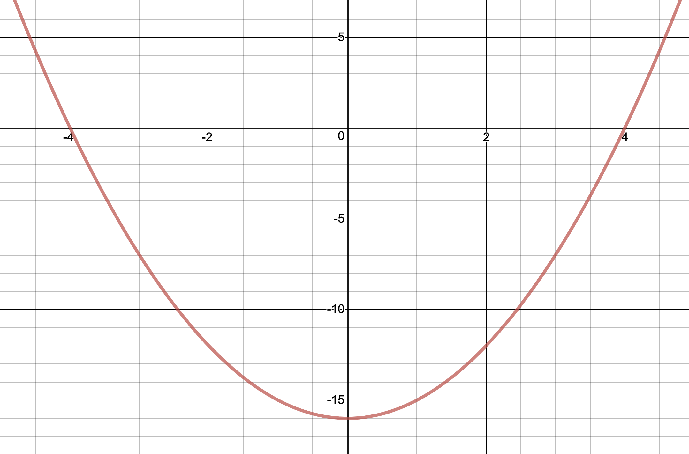
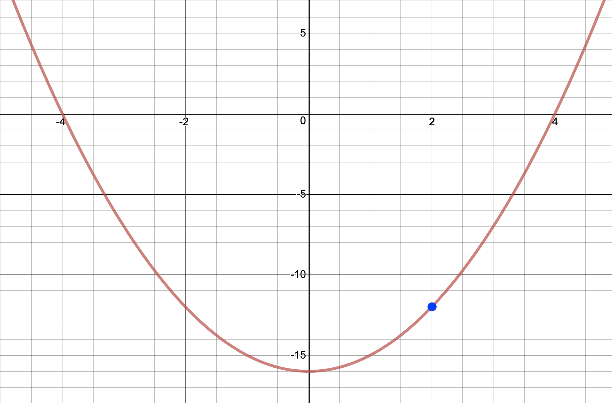
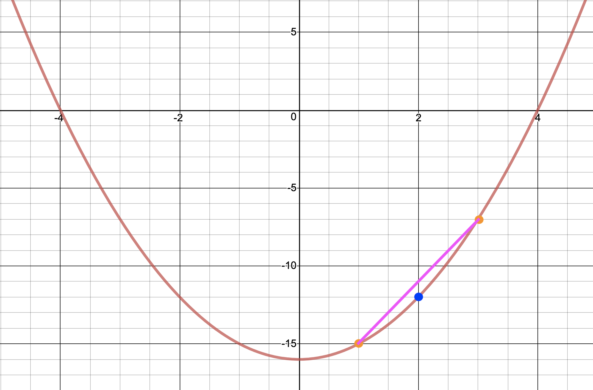
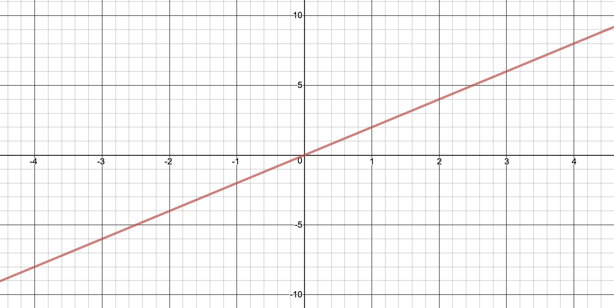
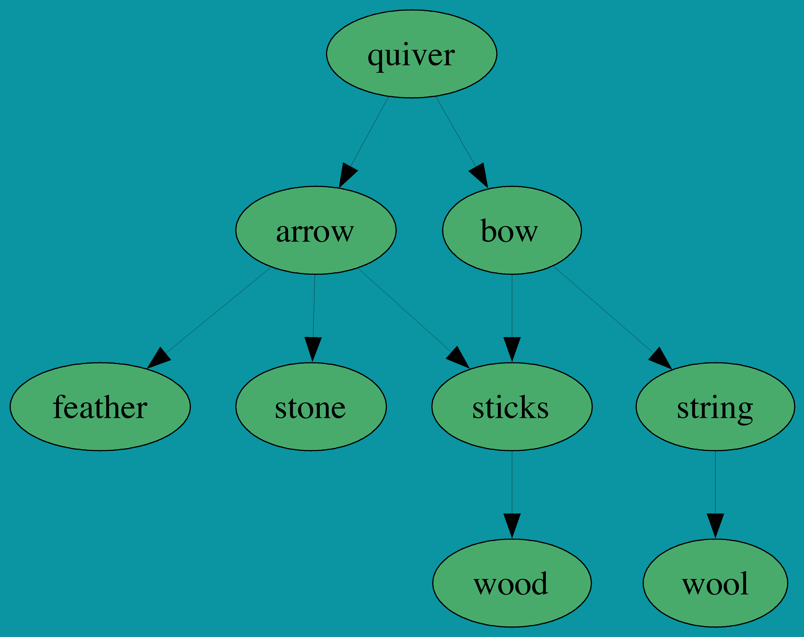
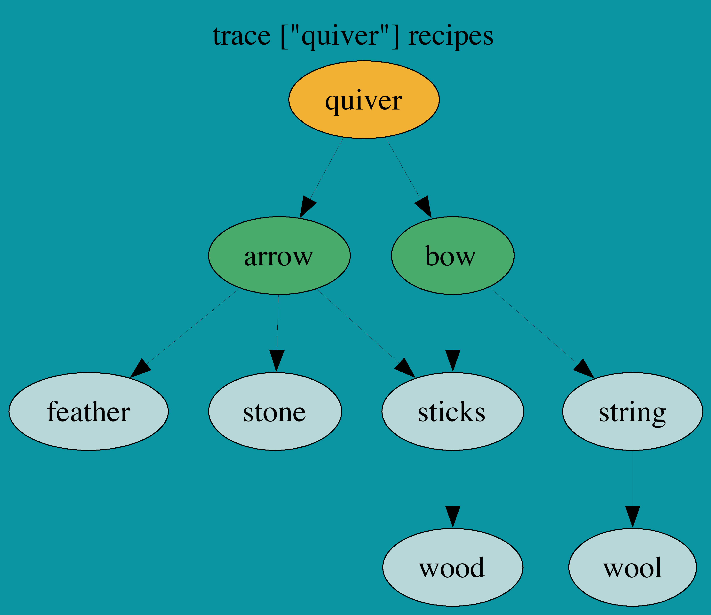
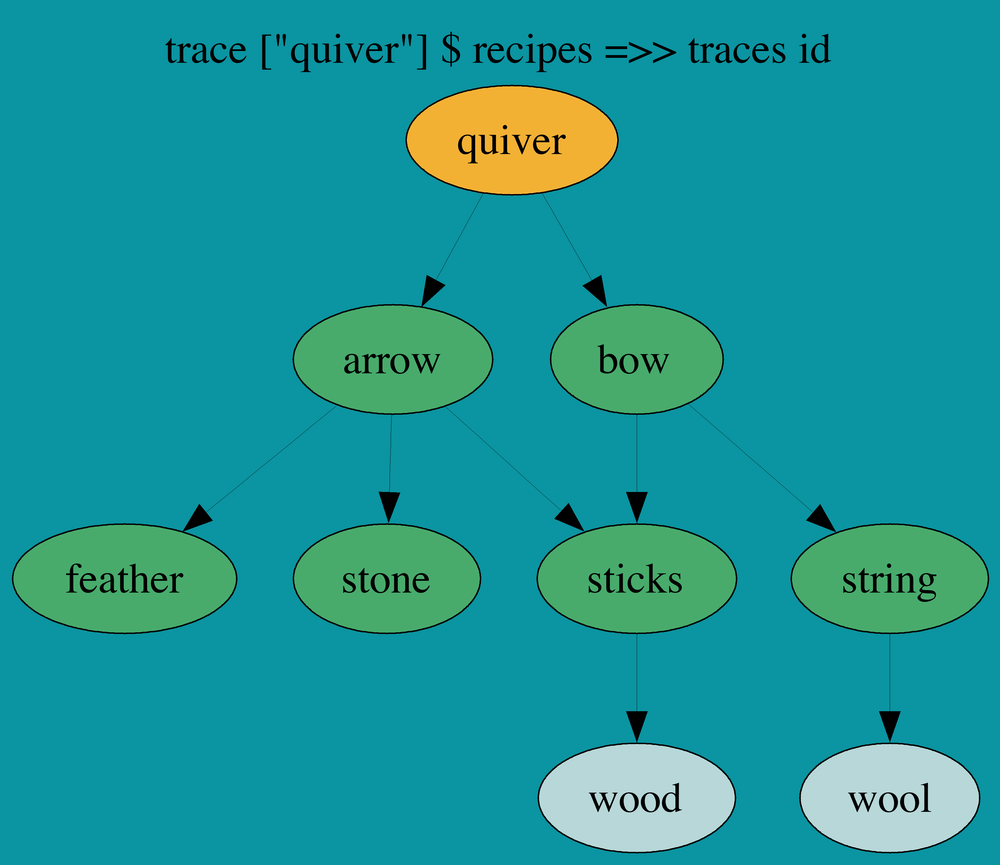

build-lists: true
theme: Ostrich, 3
slide-transition: true

^ background-color: #0F0E0E
^ text: #FF5481
^ header: #FF5481
^ text-emphasis: #FFFFFF
^ text-strong: #FF5481
^ code: auto(25)

#[fit] **Abstract Comonads**
#### *for when comonads aren't abstract enough*

---

# REVIEW

## TODO add more review here once presentations are finalized

```haskell
class Functor w => Comonad w where
  extract :: w a -> a

  duplicate :: w a -> w (w a)

  extend :: (w a -> b) -> w a -> w b
```

---

```haskell
λ> countStream
1 :> 2 :> 3 :> 4 :> 5 :> ...

λ> extract countStream
1
```

---

```haskell
λ> extend (ix 2) countStream
3 :> 4 :> 5 :> 6 :> 7 :> ...

λ> countStream =>> ix 2
3 :> 4 :> 5 :> 6 :> 7 :> ...
```

---

```haskell
λ> countStream =>> ix 2 =>> takeS 3
[3,4,5] :> [4,5,6] :> [5,6,7] :> [6,7,8] :> [7,8,9] :> ...
```

---

# Comonads 
## As Abstract Spaces

---

# Identity

```haskell
instance Comonad Identity where
extract :: Identity a -> a
extract   (Identity a) = ???
```

---

# Identity
```haskell
extract   (Identity a) = a
```
---

# Identity
```haskell
duplicate (Identity a) = ???
```
---

# Identity
```haskell
duplicate (Identity a) = Identity (Identity a)
```
---

# Identity
```haskell
extend :: (Identity a -> b) 
       -> Identity a 
       -> Identity b
extend f  (Identity a) = ???
```

---

# Identity
```haskell
extend :: (Identity a -> b) 
       -> Identity a 
       -> Identity b
extend f  (Identity a) = Identity (f (Identity a))
```

---

# Env a.k.a. Co-Reader 
## `a.k.a. (e, a)`

```haskell
data Env e a = Env e a
    deriving (Eq, Show, Functor)
```

---

```haskell
instance Comonad (Env e) where
extract   (Env _ a) = ???
duplicate (Env e a) = ???
extend f  (Env e a) = ???
```

---

```haskell
instance Comonad (Env e) where
extract   (Env _ a) = a
duplicate (Env e a) = Env e (Env e a)
extend f  (Env e a) = Env e (f (Env e a))
```

---

```haskell
ask :: Env e a -> e
ask (Env e _) = e

asks :: (e -> e') -> Env e a -> e'
asks f (Env e _) = f e

local :: (e -> e') -> Env e a -> Env e' a
local f (Env e a) = Env (f e) a
```

---

# Example

```haskell
type Range = (Int, Int)

clamp :: Env Range Int -> Int
clamp w = 
    let (lowest, highest) = ask w
    in max lowest . min highest . extract $ w

λ> clamp (Env (0, 10) 15)
10
λ> extend clamp (Env (0, 10) 15)
Env (0,10) 10
```

---

```haskell
moveBy :: Int -> Env Range Int -> Int
moveBy n = clamp . fmap (+n)

moveTo :: Int -> Env Range Int -> Int
moveTo n = clamp . fmap (const n)

adjustUpper :: Int -> Env Range Int -> Env Range Int
adjustUpper n = local (second (+n))

adjustLower :: Int -> Env Range Int -> Env Range Int
adjustLower n = local (first (+n))
```

---

[.code-highlight: 1-3]
[.code-highlight: 1-6]
[.code-highlight: 1-9]
[.code-highlight: 1-12]
[.code-highlight: all]

```haskell
λ> x = Env (0, 5) 3
Env (0,5) 3

λ> x =>> moveBy 1
Env (0,5) 4

λ> x =>> moveBy 5
Env (0,5) 5

λ> x =>> moveTo 30
Env (0,5) 5

λ> adjustUpperBy 10 x =>> moveBy 5
Env (0,15) 8

```

---

# Store a.k.a. Co-State 
## `a.k.a (s, s -> a)`

```haskell
data Store s a = Store (s -> a) s
    deriving Functor
```

---

[.code-highlight: 1-2]
[.code-highlight: 3-4]
[.code-highlight: all]

```haskell
instance Comonad (Store s) where
extract (Store f s) = f s
duplicate (Store f s) =
    Store (\s' -> Store f s') s
```

---

```haskell
pos :: Store s a -> s
pos (Store _ s) = s

peek :: s -> Store s a -> a
peek s (Store f _) = f s

peeks :: (s -> s) -> Store s a -> a
peeks g (Store f s) = f (g s)
```

---

# Examples: Dictionary

```haskell
populations :: Map String Int
populations =
    fromList [ ("Canada",        37279811)
               , ("Poland",        38028278)
               , ("France",        65480710)
               , ("United States", 329093110)
               , ("Germany",       82438639)
               ]

λ> lookup "Canada" populations
Just 37279811

λ> lookup "Wakanda" populations
Nothing

```

---

```haskell
countryPopulation :: Store String (Maybe Int)
countryPopulation 
  = Store (\country -> lookup country populations) "Canada"
```

```haskell
λ> pos countryPopulation
"Canada"
λ> peek "Poland" countryPopulation
Just 38028278
```

---

```haskell
λ> popDefault = fmap (fromMaybe 0) countryPopulation

λ> :t popDefault
popDefault :: Store String Int

λ> extract x
37279811

λ> peek "Wakanda" x
0
```

---

```haskell
squared :: Store Int Int
squared = Store (\x -> x^2) 10

λ> pos squared
10
λ> extract squared
100 -- 10^2
λ> peek 2 squared
4 -- 2^2
λ> peeks (+2) squared
144 -- (10 + 2)^2
```

---

```haskell
seek :: s -> Store s a -> Store s a
seek s (Store f _) = Store f s

seeks :: (s -> s) -> Store s a -> Store s a
seeks g (Store f s) = Store f (g s)

λ> extract $ seek 5 squared
25 -- 5^2
λ> extract $ seeks (+5) squared
225 -- (10 + 5)^2
```

---

```haskell
experiment :: Functor f => (s -> f s) -> Store s a -> f a
experiment search (Store f s) = f <$> search s

λ> experiment (const ["Canada", "Poland", "Germany"]) popDefault
[37279811, 38028278, 82438639]
```

---

```haskell
λ> experiment (\n -> [n - 10, n + 10, n + 20, n + 30]) squared
[ 0    -- (10-10)^2
, 400  -- (10+10)^2
, 900  -- (10+20)^2
, 1600 -- (10+30)^2
]

λ> experiment (\n -> (n, n)) squared
(10,100)
```

---

```haskell
λ> let withN = extend (experiment (\n -> (show n, n))) squared
λ> :t withN
withN :: Store Int (String, Int)

λ> peek 5 withN
("5",25)
```
---

# Conway's Game of Life


---

# Rules

- LIVING cells with 2 or 3 living neighbours stays alive
- DEAD cells with 3 living neighbours come to life
- All other scenarios cause a cell to die

---

github.com/alella/GOL


---


---


---


---

```haskell
conwayGrid :: Store (Int, Int) Bool
conwayGrid = store checkAlive (0, 0)
  where
    checkAlive :: (Int, Int) -> Bool
    checkAlive coord = S.member coord livingCells
    livingCells :: S.Set (Int, Int)
    livingCells = S.fromList [(0, 1), (1, 1), (2, 1)]
```

---

```haskell
λ> peek (0, 0) conwayGrid
False

λ> peek (1, 1) conwayGrid
True

λ> putStrLn $ drawGrid 3 conwayGrid
.#.
.#.
.#.

λ> putStrLn . drawGrid 3 $ step conwayGrid
...
###
...
```

---
```haskell
λ> animateGrid conwayGrid
..#....|.#.....|..#....|.......|.......
#.#....|..##...|...#...|.#.#...|...#...
.##....|.##....|.###...|..##...|.#.#...
.......|.......|.......|..#....|..##...
.......|.......|.......|.......|.......
```

---

# *CODE* __TOUR__

---

# Traced a.k.a. Co-Writer
## `a.k.a. Monoid m => m -> a`

```haskell
newtype Traced m a = Traced (m -> a)
    deriving Functor
```

---

```haskell
instance (Monoid m) => Comonad (Traced m) where
extract :: Traced m a -> a
extract (Traced f) = f mempty

duplicate :: Traced m a -> Traced m (Traced m a)
duplicate (Traced f) =
    Traced $ \m -> Traced (f . mappend m)

extend :: (Traced m a -> b) -> Traced m a -> Traced m b
extend g = fmap g . duplicate
```

---

```haskell
trace :: m -> Traced m a -> a
trace m (Traced f) = f m

traces :: Monoid m => (a -> m) -> Traced m a -> a
traces f t = trace (f (extract t)) t
```

---

# Example: Function Derivative

---



---



---


---



---



---


---

# Live Coding!

---

# Example: Dependency Tracking

```haskell
ingredientsOf :: String -> S.Set String
ingredientsOf "string"  = S.fromList ["wool"]
ingredientsOf "sticks"  = S.fromList ["wood"]
ingredientsOf "bow"     = S.fromList ["sticks", "string"]
ingredientsOf "arrow"   = S.fromList ["sticks", "feather", "stone"]
ingredientsOf "quiver"  = S.fromList ["arrow", "bow"]
ingredientsOf "torches" = S.fromList ["coal", "sticks"]
ingredientsOf _         = mempty

recipes :: Traced (S.Set String) (S.Set String)
recipes = traced (foldMap ingredientsOf)
```

---

```haskell
string  -> wool
sticks  -> wood
bow     -> sticks, string
arrow   -> sticks, feather, stone
quiver  -> arrow, bow
torches -> coal, sticks
```

```haskell
λ> trace ["string"] recipes
fromList ["wool"]
λ> trace ["string", "torches"] recipes
fromList ["coal","sticks","wool"]
λ> extract $ recipes =>> trace ["torches"]
fromList ["coal","sticks"]
```

---

```haskell
string  -> wool
sticks  -> wood
bow     -> sticks, string
arrow   -> sticks, feather, stone
quiver  -> arrow, bow
torches -> coal, sticks
```

```haskell
λ> extract $ recipes =>> traces id
fromList []
λ> trace ["quiver"] $ recipes
fromList ["arrows","bow"]
λ> trace ["quiver"] $ recipes =>> traces id
fromList ["arrows","bow","feathers","sticks","stone","string"]
λ> trace ["quiver"] $ recipes =>> traces id =>> traces id
fromList ["arrows","bow","feathers","sticks","stone","string","wood","wool"]
```

---



---



---



---

# Comonad Fix!

---


