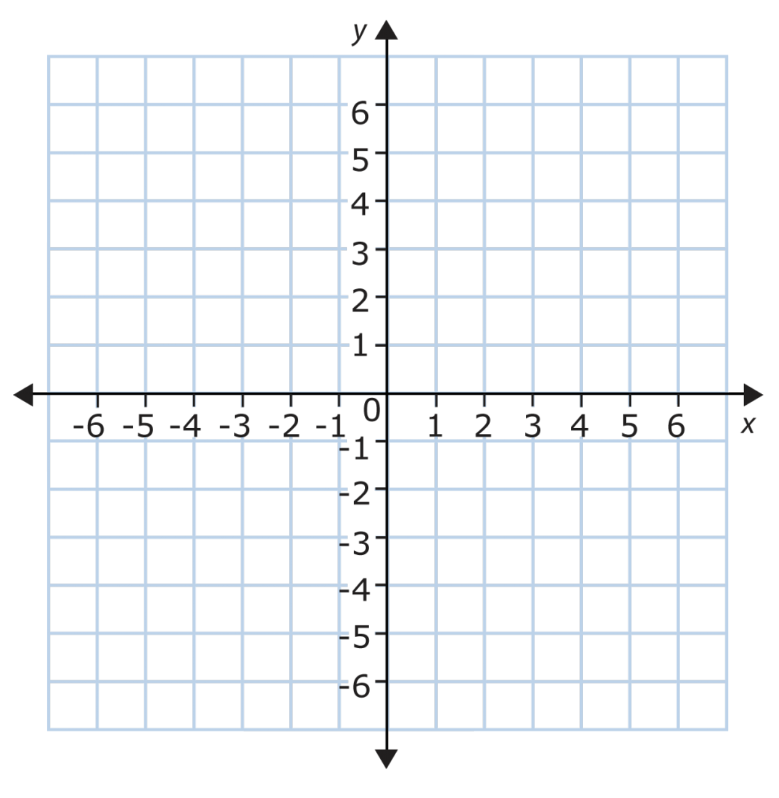

build-lists: true
theme: Ostrich, 3

^ background-color: #0F0E0E
^ text: #FF5481
^ header: #FF5481
^ text-emphasis: #FFFFFF
^ text-strong: #FF5481
^ code: auto(25)

#[fit] **Abstract Comonads**

---

# [fit] Comonads as Objects
### a'la **Gabriel Gonzalez**

---

# Identity

```haskell
instance Comonad Identity where
    extract     = runIdentity
    duplicate i = Identity i
    extend f i  = Identity (f i)
```

---

# Env a.k.a. Co-Reader a.k.a. ((,) e)

```haskell
data Env e a = Env e a
    deriving (Eq, Show, Functor)

instance Comonad (Env e) where
  extract (Env _ a) = a
  duplicate w@(Env e _) = Env e w
  extend f w@(Env e _) = Env e (f w)
```

---

```haskell
ask :: Env e a -> e
ask (Env e _) = e

asks :: (e -> e') -> Env e a -> e'
asks f (Env e _) = f e

local :: (e -> e') -> Env e a -> Env e' a
local f (Env e a) = Env (f e) a
```

---

# Store a.k.a. Co-State a.k.a (s, s -> a)

```haskell
data Store s a = Store (s -> a) s
    deriving Functor

instance Comonad (Store s) where
  extract (Store f s) = f s
  duplicate (Store f s) =
      Store (\s' -> Store f s') s
```

---

```haskell
pos :: Store s a -> s
pos (Store _ s) = s

peek :: s -> Store s a -> a
peek s (Store f _) = f s

peeks :: (s -> s) -> Store s a -> a
peeks g (Store f s) = f (g s)
```

---

```haskell
seek :: s -> Store s a -> Store s a
seek s (Store f _) = Store f s

seeks :: (s -> s) -> Store s a -> Store s a
seeks g (Store f s) = Store f (g s)
```

---

```haskell
experiment :: Functor f => (s -> f s) -> Store s a -> f a
experiment search (Store f s) = f <$> search s
```

---

# Conway's Game of Life

---

# Traced a.k.a. Co-Writer

```haskell
newtype Traced m a = Traced (m -> a)
    deriving Functor

instance (Monoid m) => Comonad (Traced m) where
  extract (Traced f) = f mempty
  duplicate (Traced f) =
      Traced $ \m -> Traced (f . mappend m)
  extend g = fmap g . duplicate
```

---

```haskell
trace :: m -> Traced m a -> a
trace m (Traced f) = f m

traces :: Monoid m => (a -> m) -> Traced m a -> a
traces f t = trace (f (extract t)) t
```

---

- Can't get the 'index' back out
- 'weaker' than Store just as Writer is 'weaker' than State
- `trace` moves the focus; `traces` uses the current value to move the focus

---



---

- absolute position

# Temperature Control

---

# Traced

# Grid position
- relative movement 

# Config Builder

---

Env vs Reader
http://blog.ielliott.io/comonad-transformers-in-the-wild/
(Env can change its environment based on a computation; reader can't unless it nests (e.g. local))

---

Compare Store to Traced via State to Writer

e.g. Store / State is more powerful than Traced / Writer;
one can be implemented in the other.

---

Hill-climbing

---

Newton's method

---

Explain watershed problem

---

Implement Zipper

---
