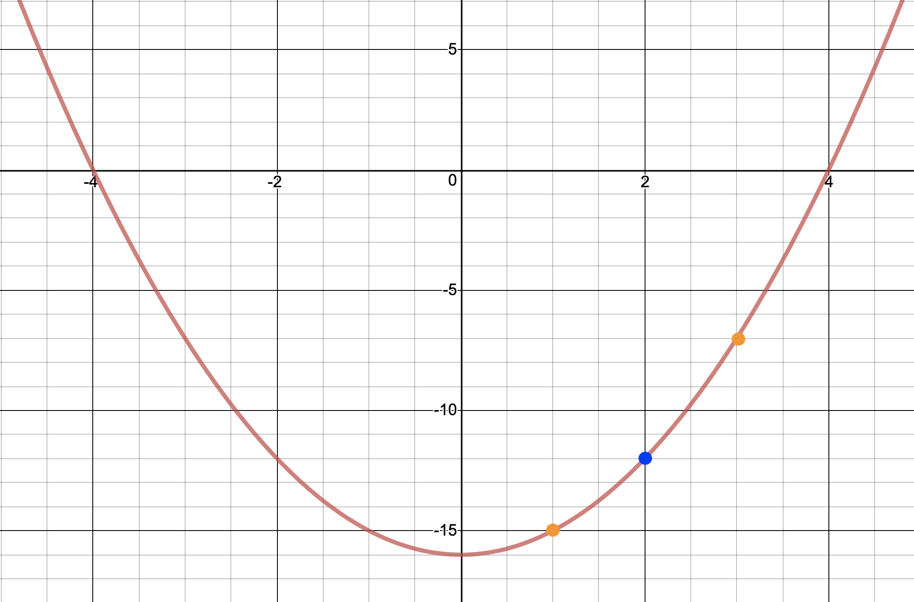

build-lists: true
theme: Ostrich, 3

^ background-color: #0F0E0E
^ text: #FF5481
^ header: #FF5481
^ text-emphasis: #FFFFFF
^ text-strong: #FF5481
^ code: auto(25)

#[fit] **Abstract Comonads**
#### *for when comonads aren't abstract enough*

---

# REVIEW

## TODO add more review here once presentations are finalized

```haskell
class Functor w => Comonad w where
  extract :: w a -> a

  duplicate :: w a -> w (w a)

  extend :: (w a -> b) -> w a -> w b
```

---

```haskell
λ> countStream
1 :> 2 :> 3 :> 4 :> 5 :> ...

λ> extract countStream
1
```

---

```haskell
λ> extend (ix 2) countStream
3 :> 4 :> 5 :> 6 :> 7 :> ...

λ> countStream =>> ix 2
3 :> 4 :> 5 :> 6 :> 7 :> ...
```

---

```haskell
λ> countStream =>> ix 2 =>> takeS 3
[3,4,5] :> [4,5,6] :> [5,6,7] :> [6,7,8] :> [7,8,9] :> ...
```

---

# Comonads 
## As Abstract Spaces

---

# Identity

```haskell
instance Comonad Identity where
extract   (Identity a) = a
duplicate (Identity a) = Identity (Identity a)
extend f  (Identity a) = Identity (f (Identity a))
```

---

# Env a.k.a. Co-Reader 
## `a.k.a. (e, a)`

```haskell
data Env e a = Env e a
    deriving (Eq, Show, Functor)
```

---

```haskell
instance Comonad (Env e) where
extract   (Env _ a) = a
duplicate (Env e a) = Env e (Env e a)
extend f  (Env e a) = Env e (f (Env e a))
```

---

```haskell
ask :: Env e a -> e
ask (Env e _) = e

asks :: (e -> e') -> Env e a -> e'
asks f (Env e _) = f e

local :: (e -> e') -> Env e a -> Env e' a
local f (Env e a) = Env (f e) a
```

---

# Example

```haskell
type Range = (Int, Int)

clamp :: Env Range Int -> Int
clamp w = 
    let (lowest, highest) = ask w
    in max lowest . min highest . extract $ w
```

---

```haskell
move :: Int -> Env Range Int -> Env Range Int
move n = fmap (+n)

adjustUpper :: Int -> Env Range Int -> Env Range Int
adjustUpper n = local (second (+n))

adjustLower :: Int -> Env Range Int -> Env Range Int
adjustLower n = local (first (+n))
```

---

```haskell
λ> let x = Env (0, 5) 3 :: Env Range Int
λ> extract x
3
λ> x =>> move 10 -- extend (move 10) x
Env (0,5) 5
```

---

## More useful as a comonad transformer 

## 😬 🤞  

---

# Store a.k.a. Co-State 
## `a.k.a (s, s -> a)`

```haskell
data Store s a = Store (s -> a) s
    deriving Functor
```

---

```haskell
instance Comonad (Store s) where
extract (Store f s) = f s
duplicate (Store f s) =
    Store (\s' -> Store f s') s
```

---

```haskell
pos :: Store s a -> s
pos (Store _ s) = s

peek :: s -> Store s a -> a
peek s (Store f _) = f s

peeks :: (s -> s) -> Store s a -> a
peeks g (Store f s) = f (g s)
```

---

```haskell
λ> pos countryPopulation
"Canada"
λ> peek "Poland" countryPopulation
Just 38028278
```

---

```haskell
seek :: s -> Store s a -> Store s a
seek s (Store f _) = Store f s

seeks :: (s -> s) -> Store s a -> Store s a
seeks g (Store f s) = Store f (g s)
```

--- 

```haskell
λ> pos $ seek "Germany" countryPopulation
"Germany"
λ> extract $ seek "Germany" countryPopulation
Just 82438639
```

---

```haskell
experiment :: Functor f => (s -> f s) -> Store s a -> f a
experiment search (Store f s) = f <$> search s
```

---

```haskell
squared :: Store Int Int
squared = Store (^(2 :: Int)) 10

λ> pos squared
10
λ> extract squared
100 -- 10^2
λ> peek 2 squared
4 -- 2^2
λ> extract $ seeks (+1) squared
121 -- (10 + 1)^2
λ> experiment (\n -> [n - 10, n + 10, n + 20, n + 30]) squared
[ 0    -- (10-10)^2
, 400  -- (10+10)^2
, 900  -- (10+20)^2
, 1600 -- (10+30)^2
]
```

---

# Conway's Game of Life

TODO: Set up workshop exercise 

---

# Traced a.k.a. Co-Writer
## `a.k.a. Monoid m => m -> a`

```haskell
newtype Traced m a = Traced (m -> a)
    deriving Functor
```

---

```haskell
instance (Monoid m) => Comonad (Traced m) where
extract :: Traced m a -> a
extract (Traced f) = f mempty

duplicate :: Traced m a -> Traced m (Traced m a)
duplicate (Traced f) =
    Traced $ \m -> Traced (f . mappend m)

extend :: (Traced m a -> b) -> Traced m a -> Traced m b
extend g = fmap g . duplicate
```

---

```haskell
trace :: m -> Traced m a -> a
trace m (Traced f) = f m

traces :: Monoid m => (a -> m) -> Traced m a -> a
traces f t = trace (f (extract t)) t
```

---

# Example: Function Derivative

---


---


---



---


---


---


---

# Live Coding!

---

# Example: Dependency Tracking

```haskell
ingredientsOf :: String -> S.Set String
ingredientsOf "string"  = S.fromList ["wool"]
ingredientsOf "sticks"  = S.fromList ["wood"]
ingredientsOf "bow"     = S.fromList ["sticks", "string"]
ingredientsOf "arrow"   = S.fromList ["sticks", "feather", "stone"]
ingredientsOf "quiver"  = S.fromList ["arrow", "bow"]
ingredientsOf "torches" = S.fromList ["coal", "sticks"]
ingredientsOf _         = mempty

recipes :: Traced (S.Set String) (S.Set String)
recipes = traced (foldMap ingredientsOf)
```

---

```haskell
string  -> wool
sticks  -> wood
bow     -> sticks, string
arrow   -> sticks, feather, stone
quiver  -> arrow, bow
torches -> coal, sticks
```

```haskell
λ> trace ["string"] recipes
fromList ["wool"]
λ> trace ["string", "torches"] recipes
fromList ["coal","sticks","wool"]
λ> extract $ recipes =>> trace ["torches"]
fromList ["coal","sticks"]
```

---

```haskell
string  -> wool
sticks  -> wood
bow     -> sticks, string
arrow   -> sticks, feather, stone
quiver  -> arrow, bow
torches -> coal, sticks
```

```haskell
λ> extract $ recipes =>> traces id
fromList []
λ> trace ["quiver"] $ recipes
fromList ["arrows","bow"]
λ> trace ["quiver"] $ recipes =>> traces id
fromList ["arrows","bow","feathers","sticks","stone","string"]
λ> trace ["quiver"] $ recipes =>> traces id =>> traces id
fromList ["arrows","bow","feathers","sticks","stone","string","wood","wool"]
```

---


---


---


---

