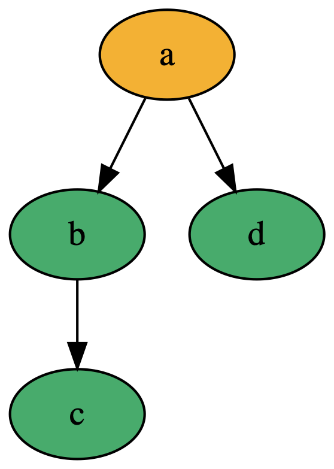

build-lists: true
theme: Ostrich, 3

^ background-color: #0F0E0E
^ text: #FF5481
^ header: #FF5481
^ text-emphasis: #FFFFFF
^ text-strong: #FF5481
^ code: auto(25)

#**Cofree**

#[fit] Comonads for _Kinda_ Free

---

#[fit] What's a __co__*free* comonad?

---

# *Free Monad* 

## a __Monad__ for any Functor

---

# __Co__*Free Comonad* 

## a Co__monad__ for any Functor

---

```haskell
data Cofree f a = a :< f (Cofree f a)
```

---

TODO: DIAGRAM OF Cofree Tree

---

Let's look at some comonads we've already seen

---

```haskell
type Stream a = Cofree Identity a
```

---

```haskell
data Cofree f a = a :< f (Cofree f a)


0, 1, 2, 3, ...
=~
0 :< Identity (1 :< Identity (2 :< Identity (3 :< ...)))
```

---

# Constructing Cofree Trees

```haskell
count :: Cofree Identity Int
count = 0 :< Identity (fmap (+1) count)
```

---
# Constructing Cofree Trees

```haskell
coiter :: Functor f 
       => (a -> f a) 
       -> a 
       -> Cofree f a
```

---

```haskell
coiter :: Functor f 
       => (a -> f a) 
       -> a 
       -> Cofree f a

count' :: Cofree Identity Int
count' = coiter coalg 0
  where
    coalg :: Int -> Identity Int
    coalg n = Identity (n + 1)
```

---

# Constructing Cofree Trees

```haskell
unfold :: Functor f 
        => (b -> (a, f b)) 
        -> b 
        -> Cofree f a

unfoldM :: (Traversable f, Monad m) 
        => (b -> m (a, f b)) 
        -> b 
        -> m (Cofree f a)
```

---

```haskell
type ??? a = Cofree Maybe a
```

---
# NonEmpty Lists

```haskell
type NonEmpty a = Cofree Maybe a
```

---
# NonEmpty Lists

```haskell
type NonEmpty a = Cofree Maybe a

alphabet :: NonEmpty Char
alphabet = coiter maybeNext 'a'
  where
    maybeNext :: Char -> Maybe Char
    maybeNext 'z' = Nothing
    maybeNext a   = Just $ succ a

λ> alphabet
'a' :< Just ('b' :< Just ('c' :< Just ... :< Just ('z' :< Nothing)))...
```

---

```haskell
type Tree a = Cofree ??? a
```
---
# Rose Trees

```haskell
type Tree a = Cofree [] a
```

---
# Rose Trees

```haskell
simpleTree :: Cofree [] Char
simpleTree = 'a' :< [ 'b' :< ['c' :< []]
                    , 'd' :< []
                    ]
```




---

# (Monadic) Rose Trees

```haskell
type Tree a = Cofree [] a

fileTree :: IO (Tree FilePath)
fileTree = unfoldM crawl "."
  where
    crawl :: FilePath -> IO (FilePath, [FilePath])
    crawl path = do
      nextLevel <- listDirectory' path
      return  (path, nextLevel)
```

---

```haskell
λ> result <- fileTree
λ> pPrint result
"." :<
    [ "stack.yaml" :< []
    , "LICENSE" :< []
    , "CHANGELOG.md" :< []
    , "comonads-by-example.cabal" :< []
    , "README.md" :< []
    , "package.yaml" :< []
    , ".stack-work" :<
        [ "install" :< []
        , "dist" :< []
        , "logs" :< []
        , "ghci" :< []
        ]
    , "src" :<
        [ "UI" :< []
        , "Comonads" :< []
        , "UIPairing" :< []
        ]
    ]
```

---

```haskell
type ??? e a = Cofree (Const e) a
```

---

# Env Comonad (e.g. Tuple)

```haskell
type Env e a = Cofree (Const e) a
```

---
# Store Comonad

```haskell
type Store s a = Cofree ??? a
```

---
# Store Comonad

```haskell
type Store s a = Cofree (Compose ??? ???) a
```

---
# Store Comonad

```haskell
type Store s a = Cofree (Compose ??? ((->) s)) a
```

---
# Store Comonad

```haskell
type Store s a = Cofree (Compose ((,) s) ((->) s)) a
```

---
# ??? Comonad

```haskell
type ??? m a = Cofree ((->) m) a
```

---
# Traced Comonad

```haskell
type Traced m a = Cofree ((->) m) a -- When `m` is a Monoid
```

---

# Natural Transformations

```haskell
hoistCofree :: Functor f 
            => (forall x. f x -> g x) 
            -> Cofree f a 
            -> Cofree g a
```

---

# Comonad Transformers

---

```haskell
class ComonadTrans t where
lower :: Comonad w => t w a -> w a 
```

---

E.g.

```haskell
EnvT Int NonEmpty a

lower :: EnvT Int NonEmpty a -> NonEmpty a
```

---

# ZipperT

```haskell
ZipperT w a = ZipperT (Zipper (w a))

lower :: ZipperT w a -> w a
lower (ZipperT z) = extract z
```

---

# StoreT

```haskell
type Grid = StoreT (Store Int) Int a
```

---

```haskell
cohoist :: (Comonad w, Comonad v) 
        => (forall x. w x -> v x) 
        -> t w a 
        -> t v a
```

---

# Zipper?

---

```haskell
data Pair a = Pair a a
    deriving (Show, Eq, Functor, Foldable, Traversable)

type Zipper a = Cofree (Compose Pair Maybe) a

moveLeft :: Zipper Int -> Maybe (Zipper Int)
moveLeft (_ :< Compose (Pair l _)) = l

moveRight :: Zipper Int -> Maybe (Zipper Int)
moveRight (_ :< Compose (Pair _ r)) = r
```

---

```haskell
zipper :: Zipper Int
zipper = unfold move ([-1, -2], 0, [1, 2])
  where
    move :: ([Int], Int, [Int]) -> (Int, Compose Pair Maybe ([Int], Int, [Int]))
    move z@(_, focus, _) = (focus, Compose $ Pair (toLeft z) (toRight z))
    toRight (ls, focus, r:rs) = Just (focus:ls, r, rs)
    toRight (_, _, []) = Nothing
    toLeft (l:ls, focus, rs) = Just (ls, l, focus:rs)
    toLeft ([], _, _) = Nothing
```

---

# Cofree/Free Pairing

---

Cofree and Free form an **Adjunction**

---

```haskell
class Adjunction f u where
    unit :: a -> u (f a)

    counit :: f (u a) -> a
```

---

```haskell
class Adjunction (Free f) (Cofree u) where
    unit :: a -> Cofree u (Free f a)

    counit :: Free f (Cofree u a) -> a
```

---

```haskell

```

---

Composing Objects using Day Convolution

https://blog.functorial.com/posts/2016-08-08-Comonad-And-Day-Convolution.html

--- 

Comonads as Spaces
https://blog.functorial.com/posts/2016-08-07-Comonads-As-Spaces.html

---

Optionality

https://blog.functorial.com/posts/2017-10-28-Comonads-For-Optionality.html

---
