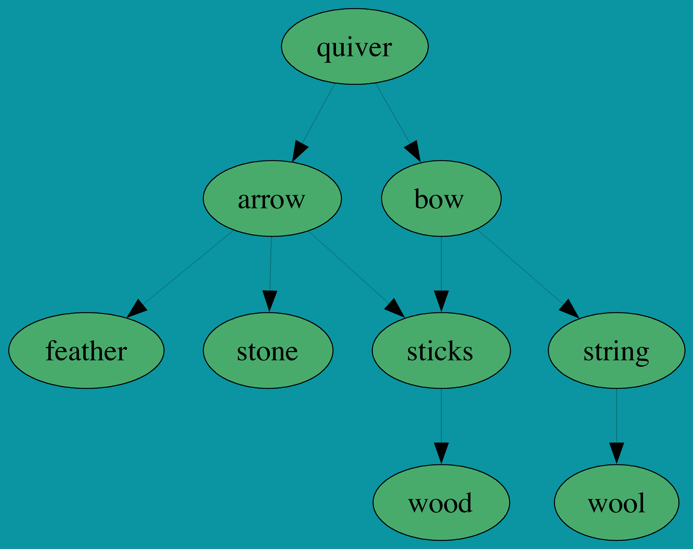
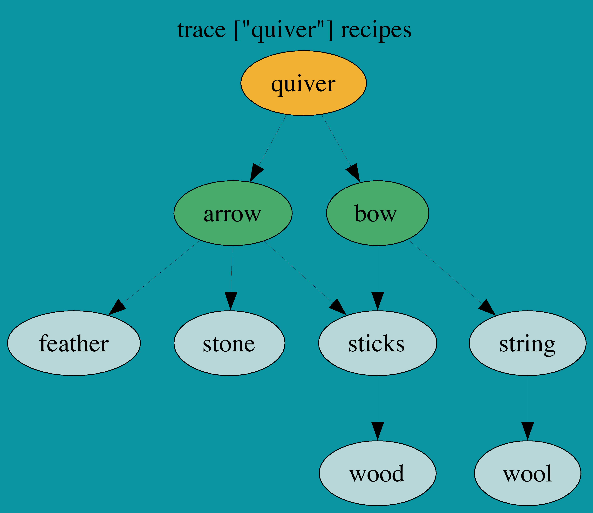
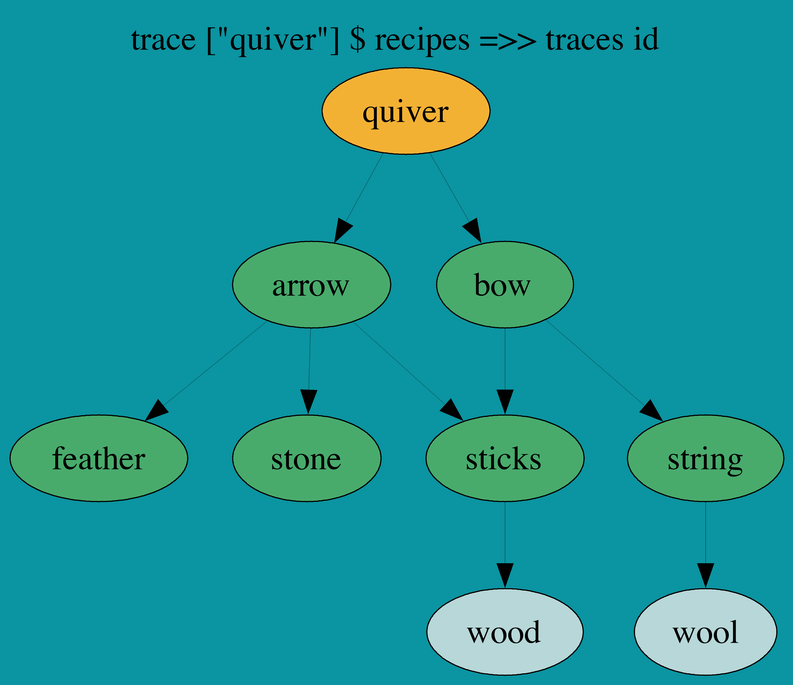
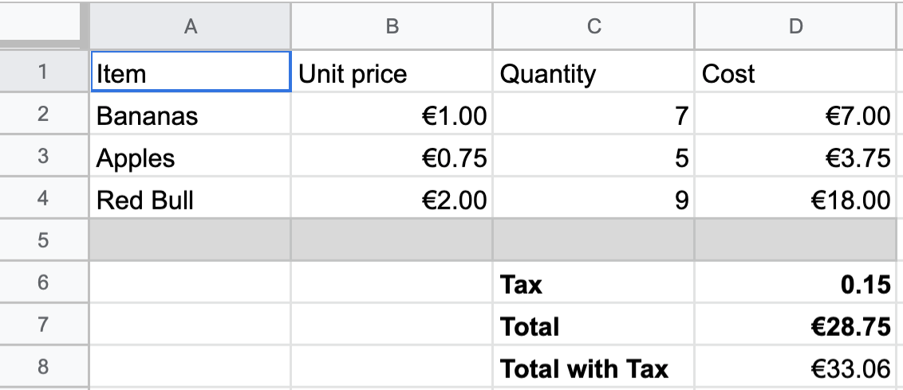
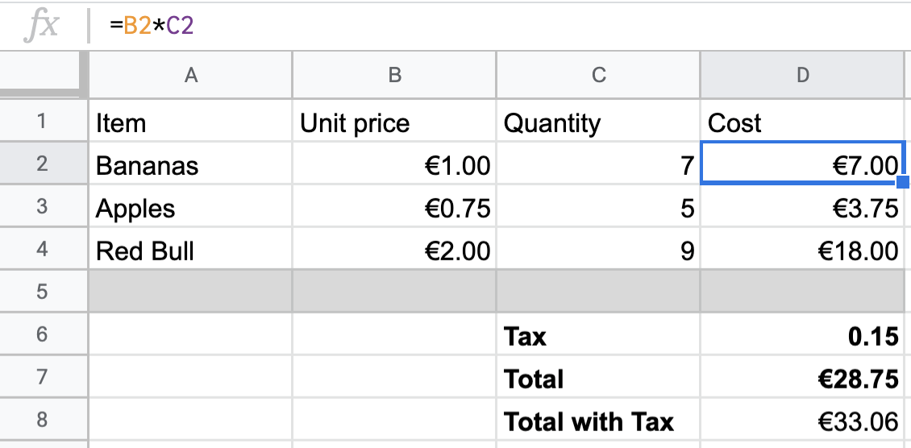
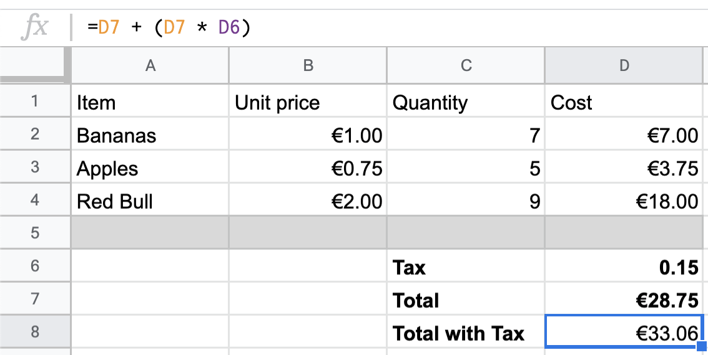
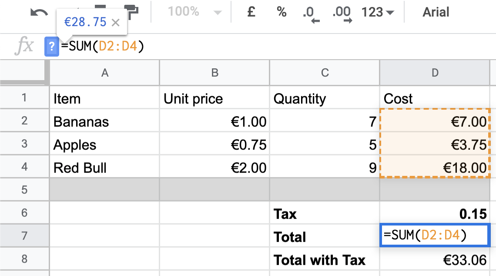

build-lists: true
theme: Ostrich, 3
slide-transition: true

^ background-color: #0F0E0E
^ text: #FF5481
^ header: #FF5481
^ text-emphasis: #FFFFFF
^ text-strong: #FF5481
^ code: auto(25)

# Comonad Fix!

```haskell
wfix :: Comonad w => w (w a -> a) -> a
```

---

# Factorial

```haskell
> factorial 3 
3 * 2 * 1
6
```

---

# Factorial

```haskell
let fact 0 = 1
    fact n = n * fact (n -1)

> fact 3
6
```

---

# Factorial

```haskell
factorialStore :: Store Int Int
factorialStore = extend wfix (store go 0)
    where
      go :: Int -> (Store Int Int -> Int)
      go 0 _ = 1
      go n w = n * peek (n - 1) w
```

---


-- | Sum of current and following numbers at each position
-- λ> sums (NE.fromList [1,2,3,4])
-- 10 :| [9,7,4]
sums :: NE.NonEmpty Int -> NE.NonEmpty Int
sums w = extend wfix (go <$> w)
  where
    go :: Int -> NE.NonEmpty Int -> Int
    go n (_ NE.:| []) = n
    go n (_ NE.:| (x:_)) = n + x

---

# Example: Dependency Tracking

```haskell
ingredientsOf :: String -> S.Set String
ingredientsOf "string"  = S.fromList ["wool"]
ingredientsOf "sticks"  = S.fromList ["wood"]
ingredientsOf "bow"     = S.fromList ["sticks", "string"]
ingredientsOf "arrow"   = S.fromList ["sticks", "feather", "stone"]
ingredientsOf "quiver"  = S.fromList ["arrow", "bow"]
ingredientsOf "torches" = S.fromList ["coal", "sticks"]
ingredientsOf _         = mempty

recipes :: Traced (S.Set String) (S.Set String)
recipes = traced (foldMap ingredientsOf)
```

---

```haskell
string  -> wool
sticks  -> wood
bow     -> sticks, string
arrow   -> sticks, feather, stone
quiver  -> arrow, bow
torches -> coal, sticks
```

```haskell
λ> trace ["string"] recipes
fromList ["wool"]
λ> trace ["string", "torches"] recipes
fromList ["coal","sticks","wool"]
λ> extract $ recipes =>> trace ["torches"]
fromList ["coal","sticks"]
```

---

```haskell
string  -> wool
sticks  -> wood
bow     -> sticks, string
arrow   -> sticks, feather, stone
quiver  -> arrow, bow
torches -> coal, sticks
```

```haskell
λ> extract $ recipes =>> traces id
fromList []
λ> trace ["quiver"] $ recipes
fromList ["arrows","bow"]
λ> trace ["quiver"] $ recipes =>> traces id
fromList ["arrows","bow","feathers","sticks","stone","string"]
λ> trace ["quiver"] $ recipes =>> traces id =>> traces id
fromList ["arrows","bow","feathers","sticks","stone","string","wood","wool"]
```

---



---



---



---

```haskell
recipes :: Traced (S.Set String) (S.Set String)
recipes = traced (foldMap ingredientsOf)

allIngredientsFor :: Traced (S.Set String) (S.Set String)
allIngredientsFor = extend wfix (selectNext <$> listen recipes)
  where
    selectNext :: (S.Set String, S.Set String)
               -> Traced (S.Set String) (S.Set String)
               -> S.Set String
    selectNext (requirements, input) t
        | S.null (S.difference requirements input) = input
        | otherwise = trace (S.difference requirements input) t
```

---

# Spreadsheets



---

# Spreadsheets


---

# Formulas



---

# Formulas



---

# Formulas



---

```haskell
data CellRef
    = Price Int
    | Quant Int
    | Cost Int
    | Tax
    | Total
    | TotalWithTax
    deriving (Show, Eq)

getCells :: Functor f => f s -> Store s a -> f a
getCells = experiment . const

-- The following data represents this spreadsheet:
--   | Price   Quant   Cost
-- 0 | 1.00    7       7.00
-- 1 | 0.75    5       3.75
-- 2 | 2.00    9       18.00
--
--   Tax    Total   Total With Tax
--  0.15    28.75   33.06

dataDef :: CellRef -> Store CellRef Double ->  Double
dataDef (Price 0) = pure 1
dataDef (Price 1) = pure 0.75
dataDef (Price 2) = pure 2

dataDef (Quant 0) = pure 7
dataDef (Quant 1) = pure 5
dataDef (Quant 2) = pure 9

dataDef (Cost r) = do
    price <- peek (Price r)
    quant <- peek (Quant r)
    return $ price * quant

dataDef Tax = pure 0.15
dataDef Total = trace "calculating total" . sum . getCells (Cost <$> [0 .. 2])
dataDef TotalWithTax = trace "calculating totalwithtax" $ do
    tax' <- peek Tax
    total' <- peek Total
    pure $ (tax' * total') + total'

dataDef _ = pure 0

sheet :: Store CellRef Double
sheet = extend wfix (store dataDef Total)

-- λ> peek Total sheet
-- 28.75
-- λ> peek Tax sheet
-- 0.15
-- λ> peek TotalWithTax sheet
-- 33.0625
```
