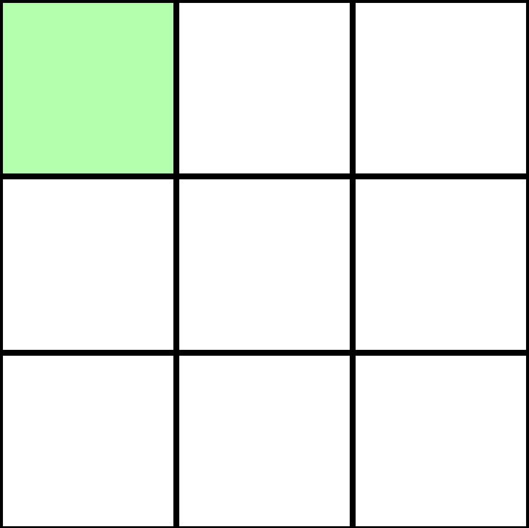
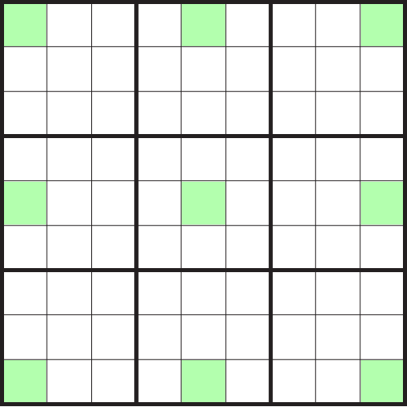

build-lists: true
theme: Ostrich, 3
footer: `💻 github.com/ChrisPenner/comonads-by-example | 🐦 @ChrisLPenner | 📝 chrispenner.ca`

^ background-color: #0F0E0E
^ text: #FF5481
^ header: #FF5481
^ text-emphasis: #FFFFFF
^ text-strong: #FF5481
^ code: auto(25)

#**Convolution**

---



---





---

```haskell

```
