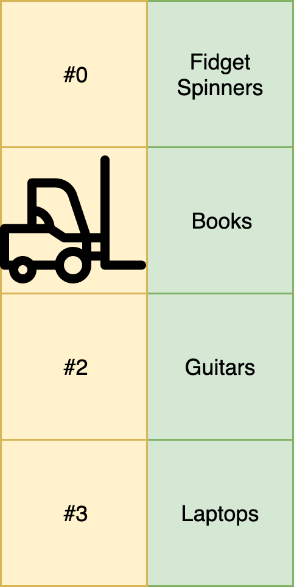
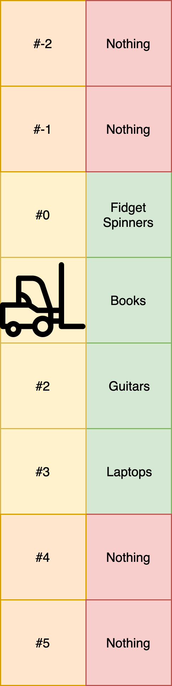
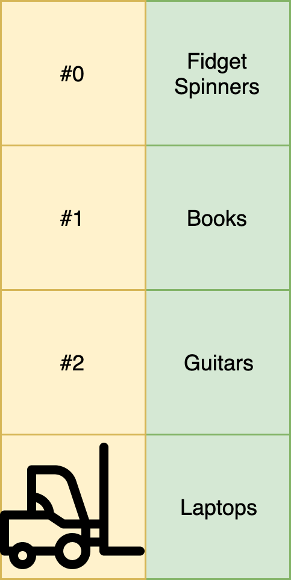
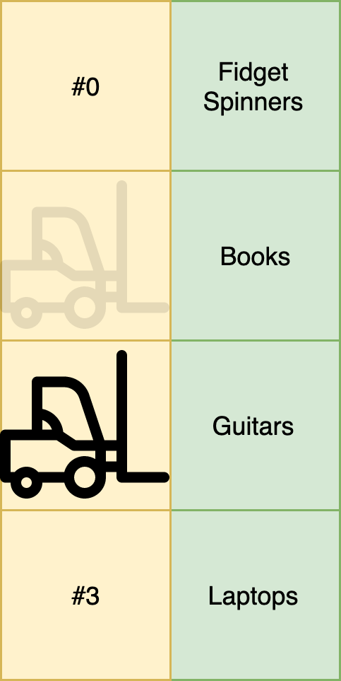
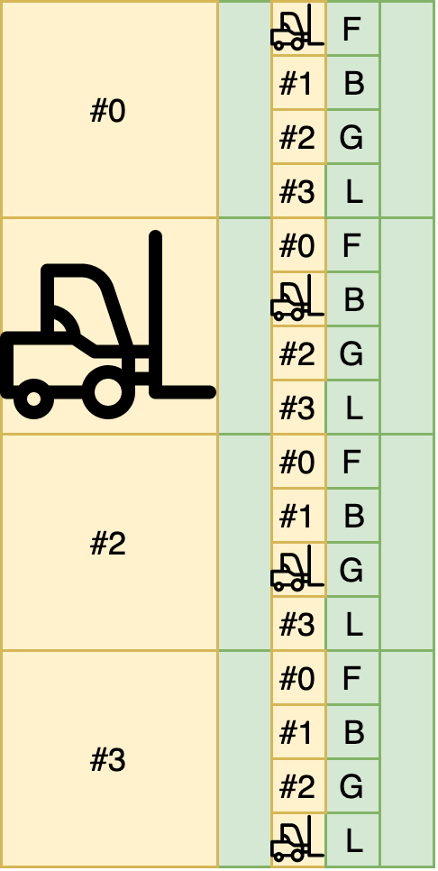

build-lists: true
theme: Ostrich, 3
slide-transition: true
slidenumbers: true
footer: `💻 github.com/ChrisPenner/comonads-by-example | 🐦 @ChrisLPenner | 📝 chrispenner.ca`

^ background-color: #0F0E0E
^ text: #FF5481
^ header: #FF5481
^ text-emphasis: #FFFFFF
^ text-strong: #FF5481
^ code: auto(25)

#[fit] **Abstract Comonads**
###[fit] *for when comonads aren't abstract enough*

---

# REVIEW

```haskell
class Functor w => Comonad w where
  extract :: w a -> a

  duplicate :: w a -> w (w a)

  extend :: (w a -> b) -> w a -> w b
```

---

#[fit] Selection
#[fit] **Queries**

---

# Selection **Queries**

#[fit]`forall a. w a -> a`

---

#[fit] Selection **Queries**
##[fit] Select a **slot**
##[fit] No matter what's inside
### e.g. `ix 5`

---

### **Running** a
#[fit] **Selection** **Query**
### Retrieves the value from that 
#[fit]**slot**

---

### **Extend**ing an
#[fit] **Selection** **Query**
#[fit] _rearranges_ 
#[fit] **slot** positions

---

## `extend (ix 2)`
### selects the **slot**
### Two to the right
### in ALL **views**

---

#[fit] Shifting each **slot** individually
# ==
#[fit] Shifting the **WHOLE** stream

---

`forall a. Stream a -> a`

```haskell
λ> duplicate countStream
   (0 :> 1 :> 2 :> ...)
:> (1 :> 2 :> 3 :> ...)
:> (2 :> 3 :> 4 :> ...)
:> ...                  

λ> ix 2  $  duplicate countStream
2 :> 3 :> 4 :> 5 :> 6 :> ...

λ> ix 2 <$> duplicate countStream
2 :> 3 :> 4 :> 5 :> 6 :> ...
```

---

#[fit] Not a selection query

#[fit]`windowedAvg :: Int -> Stream Int -> Double`


---

```haskell
λ> windowedAvg 3 $ duplicate countStream
☢️ Type Error: Stream (Stream Int) != Stream Int

λ> windowedAvg 3 <$> duplicate countStream
1.0 :> 2.0 :> 3.0 :> 4.0 :> 5.0 :> ...
```

---

```haskell
λ> countStream
0 :> 1 :> 2 :> 3 :> 4 :> ...

-- Running a selection
λ> ix 5 countStream
5

-- Extending an selection
λ> extend (ix 5) countStream
5 :> 6 :> 7 :> 8 :> 9 :> ...
```

---

#[fit]`</foreshadowing>`

---

#[fit] Note on Notation: 
#[fit] **_extend_**

---

#[fit] **`=>>`**
## Constructs & Runs
##  a **chain** of **Queries**

---

##[fit] It takes a **Structure**
## on the **left**
#[fit]`(=>>) :: w a -> (w a -> b) -> w b`
##[fit] and a **Query**
## on the **right**

---

# Note on Notation: _infix_ _extend_ 

```haskell
λ> extend (ix 2) countStream
2 :> 3 :> 4 :> 5 :> 6 :> ...

λ> countStream =>> ix 2
2 :> 3 :> 4 :> 5 :> 6 :> ...
```

---
# Notation (extend)

[.code-highlight: 1-2]
[.code-highlight: 1-5]
[.code-highlight: all]
```haskell
(=>>) :: w a -> (w a -> b) -> w b

λ> countStream
0 :> 1 :> 2 :> 3 :> 4 :> ...

-- =>> is left associative!
λ> countStream =>> ix 2 =>> ix 2
λ> (countStream =>> ix 2) =>> ix 2
4 :> 5 :> 6 :> 7 :> 8 :> ...
```

---

```haskell
λ> countStream =>> ix 2 =>> takeS 3
[3,4,5] :> [4,5,6] :> [5,6,7] :> [6,7,8] :> [7,8,9] :> ...

λ> extract $ countStream =>> ix 2 =>> takeS 3
[3,4,5]
```

---

#[fit] Note on Notation: 
#[fit] **_composition_**

---

#[fit] **`=>=`**
#[fit] Composes Queries

---

### Co-Kleisli Composition 

```haskell
(=>>) :: w a 
      -> (w a -> b) 
      -> w b
```
VS.

```haskell
(=>=) :: (w a -> b) -- Query 1
      -> (w b -> c) -- Query 2
      -> (w a -> c) -- Composed Queries
```

---

```haskell
λ> ix 2 =>= ix 2 =>= ix 2 $ countStream
6

λ> ix 2 =>= takeS 3 $ countStream
[2,3,4]
```

---

# [fit] Questions**?**

---

#[fit] **STORE**

#[fit] Stuff stored by key

---

## So what's a 
#[fit] **store?**

---

#[fit] **Warehouse**

###[fit]Labeled **shelves** with **items**
###[fit]**WELL STOCKED** (every shelf is occupied)
###[fit]Forklift is always at a **shelf**

 

---

#[fit] **Warehouse**
### Has an
#[fit] **Inventory**
### and a
#[fit] **forklift**



---

#[fit] **Warehouse**
#[fit] Queries

---

#[fit] **POS**
## Asks which **shelf**
## the **forklift** is at

---

#[fit]POS w
#[fit]`=`
#[fit]1


---

#[fit] **EXTRACT**
## Gets the  **item**
## at the current **shelf**

---

#[fit]Extract w
#[fit]`=`
#[fit]books


---

#[fit] **PEEK**
##[fit] Gets the **item**
#[fit] from a specific **shelf**

---

#[fit]peek 3 w
#[fit]`=`
#[fit]Laptops


---

#[fit] **PEEKS**
## Gets the **item**
#[fit] from a **shelf**
#[fit] **relative** to current position

---

#[fit]peeks (+1) w
#[fit]`=`
#[fit]Guitars


---

# As Code:

#[fit] `data Store s a = Store (s -> a) s`

---

# Warehouse Example

```haskell
inventory :: M.Map Int String
inventory =
    M.fromList [ (0, "Fidget spinners")
               , (1, "Books")
               , (2, "Guitars")
               , (3, "Laptops")
               ]
```

---

```haskell
λ> lookup 0 inventory
Just "Fidget spinners"

λ> lookup 42 inventory
Nothing
```

---

#[fit] Every key has a value



---

```haskell
warehouse :: Store Int (Maybe String)
warehouse = 
  store (\shelf -> M.lookup shelf inventory) 1
```

---


```haskell
λ> pos warehouse
1

λ> peek 0 warehouse
Just "Fidget Spinners"

λ> peeks (+1) warehouse
Just "Guitars"
```

---

#[fit] **SEEK**
##[fit] Moves the forklift
##[fit] to a **specific** shelf

---

#[fit]seek 3 w


---

#[fit] **SEEKS**
##[fit] Moves the forklift
##[fit] **relative** to current position

---

#[fit]seeks (+1) w


---

#[fit] Store 
### _a.k.a. Co-State_

#[fit] A **slot** for every _key_
#[fit] A **view** from every _key_
#[fit] **extract** the value at your _key_
 

---

#[fit] **Store**
### Has a
#[fit] **getter**
### and a
#[fit] **key**

---

#[fit] **Store**
#[fit] **Queries**

---

#[fit] **POS**
#[fit] `pos :: Store s a -> s`
## Gets the 
## current **key**

---

#[fit] **EXTRACT**
#[fit] `extract :: Store s a -> a`
## Gets the  **slot**
## at the current **key**


---

#[fit] **PEEK**
#[fit] `peek :: s -> Store s a -> a`
##[fit] extracts the **slot** at another **key**

#### * Selection Query!!

---

```haskell
squared :: Store Int Int
squared = 
  Store (\x -> x^2) -- The getter
        10          -- The current key
```

---

[.code-highlight: 1-5]
[.code-highlight: 1-8]
[.code-highlight: all]
```haskell
squared :: Store Int Int
squared = Store (\x -> x^2) 10

λ> pos squared
10

λ> extract squared
100 -- 10^2

λ> peek 2 squared
4 -- 2^2
```

---

#[fit] **PEEKS**
#[fit] `peeks :: (s -> s) -> Store s a -> a`
## Get a slot at a
#[fit] **relative** position
##[fit] To the current **key**

---

```haskell
λ> pos squared
10

λ> peeks (+2) squared
144 -- (10 + 2)^2
```

---

#[fit] **RELATIVE QUERIES**
## _like peeks_
#[fit] Have different results
#[fit] depending on the current **view**

---

#[fit] **ABSOLUTE QUERIES**
#[fit] *Ignore*
#[fit] the current **view**

---

#[fit] `peek 2`
#[fit] is an **absolute** query

---

#[fit] Store
#[fit] **Mutations**

---

#[fit] **SEEK**
#[fit] `seek :: s -> Store s a -> Store s a`
##[fit] Focus the **slot** 
### at the 
##[fit] given **key**

---

#[fit] **SEEK**
### is an
#[fit] **absolute** mutation

---

# Store

[.code-highlight: 1-3]
[.code-highlight: 1-6]
[.code-highlight: all]
```haskell
λ> pos $ seek 5 squared
5

λ> pos $ seek 3 squared
3

λ> extract $ seek 3 squared
9
```

---

#[fit] **SEEKS**
#[fit] `seeks :: (s -> s) -> Store s a -> Store s a`
##[fit] The **relative**
### version of
##[fit] **seek**

---


#[fit] Experiment


---

#[fit] It's really annoying
##[fit] to **peek** at **lots** of nearby values

---

## What if we want to 
#[fit] **keep track**
## of the results?

---

## Or even 
#[fit] **fail**
#[fit] based on our **position**?

---

## Experiment
### Gets a
#[fit] **BUNCH**
### of values
#[fit] **relative** to your position


---

# **experiment**
```haskell
experiment :: Functor f 
           => (s -> f s) 
           -> Store s a 
           -> f a
```

---

# Store Example: Squared

```haskell
λ> experiment (\n -> [n - 10, n + 10]) squared
[ 0    -- (10-10)^2
, 400  -- (10+10)^2
]
```

---

```haskell
aboveZero n | n > 0     = Just n
            | otherwise = Nothing
λ> experiment aboveZero (seeks 10 squared)
Just 100

λ> experiment aboveZero (seeks (-10) squared)
Nothing
```

---
[.code-highlight: 1-3]
[.code-highlight: 1-5]
[.code-highlight: all]

```haskell
withN :: Store Int (String, Int)
withN = squared =>> experiment (\n -> (show n, n))

λ> extract withN
("10",100)

λ> peek 5 withN
("5",25)
```

---

# Store Example: Squared

[.code-highlight: 1-3]
[.code-highlight: 1-5]
[.code-highlight: all]

```haskell
shifted :: Store Int (String, Int)
shifted = withN =>> peeks (+10)

λ> extract shifted
("20",400)

λ> peek 5 shifted
("15",225)
```

---

# [fit] Questions**?**

---


# Conway's Game of Life


---

# Rules

- LIVING cells with 2 or 3 living neighbours stays alive
- DEAD cells with 3 living neighbours come to life
- All other scenarios cause a cell to die

---


---


---

#[fit] We gonna build this:

```haskell
λ> animateGrid startingGrid
..#....|.#.....|..#....|.......|.......
#.#....|..##...|...#...|.#.#...|...#...
.##....|.##....|.###...|..##...|.#.#...
.......|.......|.......|..#....|..##...
.......|.......|.......|.......|.......
```

---

# 🤓 Let's plan

---

#[fit] We need to represent a 
#[fit] _2D_ **GRID**
#[fit] of **cells**

---

#[fit] Each **cell**
### is either
#[fit] _Alive_
### or
#[fit] _Dead_

---

#[fit] so I'm **thinking**

#[fit]`Store (Sum Int, Sum Int) Bool`

---

#[fit] `(row, column) -> alive?`

---

#[fit] Questions?

---

[.code-highlight: 1-2]
[.code-highlight: 1-5]
[.code-highlight: all]

```haskell
startingGrid :: Store (Sum Int, Sum Int) Bool
startingGrid = store checkAlive (0, 0)
  where
    checkAlive :: (Sum Int, Sum Int) -> Bool
    checkAlive coord = S.member coord livingCells

    livingCells :: S.Set (Sum Int, Sum Int)
    livingCells = S.fromList [(1, 0), (2, 1), (0, 2), (1, 2), (2, 2)]
```

---

```haskell
λ> peek (Sum 0, Sum 0) startingGrid
False

λ> peek (Sum 1, Sum 0) startingGrid
True

λ> putStrLn . drawGrid 3 $ startingGrid
..#
#.#
.##
```

---

## We want a 
#[fit] **mutation**
## which simulates a
#[fit] **step**

---

#[fit] as **always**
# let's break it down ⬇
## _into_ **queries**

---

# Query:

```haskell
checkCellAlive :: Store (Sum Int, Sum Int) Bool
               -> Bool
```

---

### If we can compute whether
#[fit] **ONE** **cell** 
### is alive;
### we can _extend_ it to 
#[fit] **ALL CELLS**

---

#### 😮 wow 😲

---

## Our recipe needs the following ingredients:

1. Whether the current cell is alive or dead

2. Number of living neighbours


---

## Query to check the 
#[fit]**Current cell**

### any ideas?

---

#[fit] **EXTRACT**
### ...NEXT

---

Number of living neighbours

```haskell
numLivingNeighbours :: Store (Sum Int, Sum Int) Bool
                    -> Int
```

---

## We need to check the 
## **cells next door**

---

## Remember 
# **Experiment**?

```haskell
experiment :: Functor f 
           => (s -> f s) 
           -> Store s a 
           -> f a
```

---

We can check our neighbours 
all at once!

---

# Formulating our experiment

```haskell
neighbourLocations :: (Sum Int, Sum Int) -> [(Sum Int, Sum Int)]
neighbourLocations location = mappend location <$> [
     (-1, -1), (-1, 0), (-1, -1)
   , (0,  -1),          (0,  1)
   , (1,  -1), (1, 0),  (1,  1)
]
```

---

# Now to test our hypothesis:

```haskell
numLivingNeighbours :: Store (Sum Int, Sum Int) Bool -> Int
numLivingNeighbours w = 
    getSum . foldMap toCount . experiment neighbourLocations $ w
  where
    toCount :: Bool -> Sum Int
    toCount False = Sum 0
    toCount True = Sum 1
```

---

# All set!

---

```haskell
checkCellAlive :: Store (Sum Int, Sum Int) Bool -> Bool
checkCellAlive grid =
    case (extract grid, numLivingNeighbours grid) of
        (True, 2) -> True
        (_,    3) -> True
        _         -> False
```

---

# [fit] Questions**?**

---

## Now we extend it to 
#[fit] **all the cells**!

---

```haskell
step :: Store (Sum Int, Sum Int) Bool
     -> Store (Sum Int, Sum Int) Bool
step = extend checkCellAlive
```

---

#[fit] A note on performance

---

#[fit] QUESTIONS?

---

### Challenge A: Implement Comonad for Store

```haskell
instance Comonad (Store s) where
  extract :: Store s a -> a

  duplicate :: Store s a -> Store s (Store s a)

  extend :: (Store s a -> b) -> Store s a -> Store s b
```

### Challenge B: Add a new ruleset for Conway's Game of Life

---

END

---

```haskell
instance Comonad (Store s) where
  extract :: Store s a -> a
  extract (Store f s) = f s

  duplicate :: Store s a -> Store s (Store s a)
  duplicate (Store f s) =
      Store (\s' -> Store f s') s

  extend :: (Store s a -> b) -> Store s a -> Store s b
  extend g st = g <$> duplicate st
```

---

Bonus

---

#[fit] extending
### a
## **selection query**
#[fit] _s h i f t s_
### slots

---

```haskell
λ> pos squared
10
λ> extract squared
100
λ> peeks (+1) squared
121
```

---

```haskell
shifted :: Store Int Int
shifted = squared =>> peeks (+1)

λ> peek 2 shifted
9

λ> peek 10 shifted
121
```

---

Note the difference:

```haskell
λ> pos shifted 
10
λ> extract shifted
121
VS.
λ> pos $ seeks (+1) squared 
11
λ> extract $ seeks (+1) squared
121
```

---

# Duplicate!

---




---

# Extend
## let's us write
#[fit] **Function**
#[fit] **Middleware**

---

```haskell
-- Precompose
normalizePath :: Store T.Text T.Text -> T.Text
normalizePath = peeks cleaned
  where
    cleaned url = T.strip . T.toLower $ url

-- Postcompose
collapseSlashes :: Store T.Text T.Text -> T.Text
collapseSlashes = T.replace "//" "/" . extract

-- Wrapping transform
showTransformation :: Store T.Text T.Text -> T.Text
showTransformation w = pos w <> ": " <> extract w

badUrl :: T.Text
badUrl = " gOOgLe.com//a/B//c  "

urlTransformer :: Store T.Text T.Text
urlTransformer = store id "" =>> collapseSlashes =>> normalizePath =>> showTransformation
```
