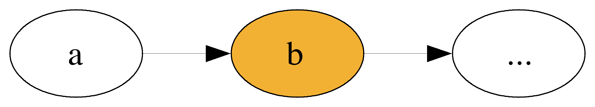
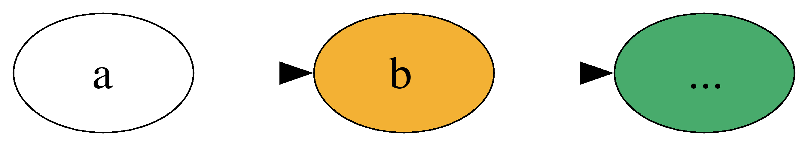

build-lists: true
theme: Ostrich, 3
slide-transition: true
slidenumbers: true

^ background-color: #0F0E0E
^ text: #FF5481
^ header: #FF5481
^ text-emphasis: #FFFFFF
^ text-strong: #FF5481
^ code: auto(25)

#[fit] **Comonads**
#[fit] *comonoids in the category of endofunctors*
#[fit] *what's the problem?*

---

# Outline

```
1. Session 1
    1. Overview of Comonads
    2. Streams
    3. *BREAK*

1. Session 2
    1. Store
```

---

# Get the SRC
### github.com/ChrisPenner/comonads-by-example

```
git clone git@github.com:ChrisPenner/comonads-by-example
cd comonads-by-example
stack build
```

---

#[fit] Monads


---

#[fit] Co-monads


---

#[fit] **Monads**

## [fit] Introduce Effects

---

#[fit] `putStrLn :: String -> IO ( )`

---

#[fit] `readFile :: FilePath -> IO String`

---

#[fit] `words :: String -> [String]`

---

### Effect Construction

#[fit] `find :: (a -> Bool) -> [a] -> Maybe String`

---

#[fit]  **Effects**
##[fit] _Add a_ Context
##[fit] _To an_ Element

#[fit] `a -> m b`

---

###[fit] What about **Co**Effects?

---

#[fit] *Duals*
####[fit] **flip** all the things

---

# **Co**Effects


#[fit] `a -> m b`
#[fit] __`b <- w a`__

---

# **Co**Effects

#[fit] `a -> m b`
#[fit] __`w a -> b`__

---

# [fit] **Co**Effects
## [fit] are **Queries**
## [fit] over a **Structure**

---

# [fit] `length :: [a] -> Int`

---

# [fit] `head :: [a] -> a`

---

### Query Construction
# [fit] `elem :: a -> ([a] -> Bool)`

---

# [fit] `fst :: (a, b) -> a`
# ` `
# [fit] `snd :: (a, b) -> b`

---

# [fit] `sum :: Tree Int -> Int`

---

# [fit] **Monads** _let us_
# [fit] compose **effects**

---

#[fit] _Confusing?_

##[fit] _let's add some_ **context**

---

#[fit] Monads
###[fit] are a **context**
###[fit] where we can introduce **effects**

---

#[fit] **Co**monads
###[fit] are a **context**
###[fit] where we can extract run **queries**

---

#[fit] Let's look at a specific **context**
#[fit] `  `
#[fit] `  `
#[fit] `data Stream a = a :> Stream a`


---

`:>` is an **infix** data constructor

```haskell
data Stream a = a :> Stream a
       deriving (Functor, Foldable)
```

---

```haskell
fromList :: [a] -> Stream a
fromList xs = go (cycle xs)
  where
    go (a:rest) = a :> go rest

countStream :: Stream Int
countStream = fromList [0..]
λ> 0 :> 1 :> 2 :> 3 :> 4 :> ...
```

---

# Let's write some 
##[fit] **Q**u**e**r**i**e**s**

a.k.a. **Co**Effects

---

#[fit]`ix :: Int -> Stream a -> a`

---

```haskell
ix :: Int -> Stream a -> a
ix n _ | n < 0 = error "whoops"
ix 0 (a :> _) = a
ix n (_ :> rest) = ix (n - 1) rest
```

---

```haskell
λ> ix 0 countStream
0

λ> ix 2 countStream
2

λ> ix 1337 countStream
1337
```

---


---

# [fit] **So What??**

---

#[fit] Now we want to write **drop**!

##[fit] `dropS :: Int -> Stream a -> Stream a`

---

## Desired Behaviour

```haskell
λ> countStream
0 :> 1 :> 2 :> 3 :> 4 :> ...

λ> dropS 1 countStream
1 :> 2 :> 3 :> 4 :> 5 :> ...

λ> dropS 2 countStream
2 :> 3 :> 4 :> 5 :> 6 :> ...
```

---

#[fit] `Stream a -> Stream b`
### is a 
# **Mutation**

---

# Other **Mutations**

---

#[fit] `gaussianBlur :: Image Pixel -> Image Pixel`

---

```haskell
scanl :: (b -> a -> b) 
      -> b 
      -> [a] -> [b]
```

---

#[fit] `popHeap_ :: Heap Int -> Heap Int`

---


#[fit] `deleteColumn :: SpreadSheet a -> SpreadSheet a`


---


# [fit]`derivative :: (Double -> Double) -> (Double -> Double)`


---

#[fit] `gaussianBlur :: Image Pixel -> Image Pixel`

---

# Also

* Solve Hill Climbing Problems
* Compute Roots using Newton's Method
* Compute dependency trees
* Graph Traversals
* Crush the Coding Interview (Rainwater Problem)

---

#[fit] **Where** were we?

---

```haskell
have:
λ> ix 2 countStream
2

want:
λ> dropS 2 countStream
2 :> 3 :> 4 :> 5 :> 6 :> ...
```

---

## **Similar??**

```haskell
have:
ix    :: Int -> Stream a ->        a

want:
dropS :: Int -> Stream a -> Stream a
```

---


### Can we turn 
#[fit]**query** 
### into a 
#[fit]**mutation**?

---

# [fit] Back 
### _to the_
#[fit] **Monad**

---

#[fit]  **join**

---

# [fit] `join :: m (m a) -> m a`

# [fit] **`cojoin?? :: w a -> w (w a)`**

---

# **WTH**
## _is_
#[fit] **Co**Join?

---

# [fit] `duplicate :: w a -> w (w a)`

---

# WUT?

---

# _Duplicate_
#[fit] **Nests** your **Structure**
### while maintaining
#[fit] **Context**

---

# [fit] The **Context** of a **Stream** 
## is its
# [fit] __*position*__

---


```haskell
λ> countStream
1 :> 2 :> 3 :> 4 :> 5 :> ...

λ> duplicate countStream
(1 :> 2 :> ...) 
  :> (2 :> 3 :> ...) 
  :> (3 :> 4 :>...) 
  :> ...

```

---

# Duplicate


^ Talk about Duplicate/Extract law

---

##[fit] **_ix_** _focuses a_
# **location**
## _within the_ **structure**

---

```haskell
ix        :: Int -> Stream a -> a
duplicate :: Stream a -> Stream (Stream a)
ix 10 <$> duplicate s :: Stream a
```

---

## What are they?

Comonads represent **SPACES** with a **reference point**

---

# Non-Empty Lists


---

# Trees


---

# Spreadsheets


---

# Zipper


---

# Functions


---

# Stream

[.code-highlight: 1-2]
[.code-highlight: all]

```haskell
data Stream a = a :> Stream a
    deriving (Functor, Foldable)

fromList :: [a] -> Stream a
fromList xs = go (cycle xs)
  where
    go [] = error "don't do that silly"
    go (a:rest) = a :> go rest
```


---

```haskell
'a' :> 'b' :> ...
```


---

# Challenge

Compute a rolling average over a stream of integers

```haskell
rollingAvg :: Int           -- Window Size
           -> Stream Int    -- Input Stream
           -> Stream Double -- Stream of averages
```

---

E.g. `rollingAvg 2`


[.code-highlight: 1-2]
[.code-highlight: 1-5]
[.code-highlight: all]
```haskell
λ> evens
0 :> 2 :> 4 :> 6 :> ...

λ> rollingAvg 2 evens
(0 + 2) / 2 :> (2 + 4) / 2 :> (4 + 6) / 2 :>  ...
-- reduces to
1 :> 3 :> 5 :> 7 :> ...
```

---

```haskell
windowedAvg :: Int        -- window size
            -> Stream Int -- input stream
            -> Double     -- avg of first window
windowedAvg windowSize input = ???
```

---

```haskell
avg :: [Int] -> Double
avg xs =
      fromIntegral (sum xs)
    / fromIntegral (length xs)
```

---

```haskell
windowedAvg :: Int        -- window size
            -> Stream Int -- input stream
            -> Double     -- avg of first window
windowedAvg windowSize input = avg window
    where
      window :: [Int]
      window = ???
```

---

[.code-highlight: 1-2]
[.code-highlight: all]
```haskell
takeS :: Int -> Stream a -> [a]
takeS n input = take n (toList input)

λ> countStream
1 :> 2 :> 3 :> 4 :> 5 :> ...

λ> takeS 3 countStream
[1,2,3]
```

---

```haskell
windowedAvg :: Int -> Stream Int -> Double
windowedAvg windowSize input = avg window
  where
    window :: [Int]
    window = takeS windowSize input
```

---

```haskell
rollingAvg :: Int           -- Window Size
           -> Stream Int    -- Input Stream
           -> Stream Double -- Stream of averages

input       :: Stream Int
windowedAvg :: Int -> Stream Int -> Double
output      :: Stream Double
```

---

```haskell
windowedAvg 3 :: Stream Int -> Double
???           :: Stream Int -> Stream Double
```

---

```haskell
windowedAvg 3 :: m a -> b
???           :: m a -> m b
```

---

```haskell
??? :: (m a -> b) -> (m a -> m b)
```

---

## Comonad vs Monad
```haskell
???  :: *(m a -> b)* -> m a -> m b
bind :: *(a -> m b)* -> m a -> m b
```

---

## Monad

[.code-highlight: 1-3]
[.code-highlight: all]
```haskell
f        :: a -> m b
x        :: m a
join     :: m (m a) -> m a

fmap f x        :: m (m b)
join (fmap f x) :: m b
```

---

# Duplicate?

```haskell
duplicate :: Stream Int -> Stream (Stream Int)
duplicate s@(_ :> next) = s :> duplicate next
```

---


```haskell
??? :: (Stream Int -> Double) 
    -> Stream Int 
    -> Stream Double
??? f input = fmap f (duplicate input)
```

---

```haskell
extend :: (Stream Int -> Double) 
       -> Stream Int 
       -> Stream Double
extend f input = fmap f (duplicate input)
```

---

```haskell
windowedAvg :: Int -> Stream Int -> Double

extend      :: (Stream Int -> Double) 
            -> Stream Int 
            -> Stream Double

rollingAvg :: Int -> Stream Int -> Stream Double
rollingAvg windowSize input = 
  extend (windowedAvg windowSize) input
```

---

```haskell
λ> countStream
1 :> 2 :> 3 :> 4 :> 5 :> ...

λ> duplicate countStream
(1 :> 2 :> ...) 
  :> (2 :> 3 :> ...) 
  :> (3 :> 4 :>...) 
  :> ...

```

---

[.code-highlight: 1-5]
[.code-highlight: 6-8]
[.code-highlight: 6-11]
```haskell
λ> countStream
1 :> 2 :> 3 :> 4 :> 5 :> ...

λ> takeS 3 countStream
[1,2,3]

λ> fmap (takeS 3) (duplicate countStream)
[1,2,3] :> [2,3,4] :> [3,4,5] :> ...

λ> extend (takeS 3) countStream
[1,2,3] :> [2,3,4] :> [3,4,5] :> ...
```

---

```haskell
extend :: *(m a -> b)* -> m a -> m b
bind   :: *(a -> m b)* -> m a -> m b

=>>  :: w a -> (w a -> b) ->  w b
>>=  :: m a -> (a -> m b) ->  m b
```

---

```haskell
instance Comonad w where
  extract   :: w a -> a
  duplicate :: w a -> w (w a)
  extend    :: (w a -> b) -> w a -> w b
{-# MINIMAL extract, (duplicate | extend) #-}

instance Monad m where
  return  :: a -> m a
  join    :: m (m a) -> m a
  (>>=)   :: m a -> (a -> m b) ->  m b
```

---

# Comonad Laws!

```
extend extract      = id
extract . extend f  = f
extend f . extend g = extend (f . extend g)
```

---

# Extract

```haskell
extract :: w a -> a
return  :: a   -> m a

extract :: Stream a -> a
```

---

```haskell
duplicate :: w a     -> w (w a)
join      :: m (m a) -> m a

duplicate :: Stream a -> Stream (Stream a)
```

---

```haskell
instance Comonad Stream where
  extract   :: Stream a -> a
  duplicate :: Stream a -> Stream (Stream a)
  extend    :: (Stream a -> b) -> Stream a -> Stream b
```

---

[.code-highlight: 1-3]
[.code-highlight: 5-7]
[.code-highlight: 8-11]
```haskell
instance Comonad Stream where
  extract :: Stream a -> a
  extract (a :> _) = a

  duplicate :: Stream a -> Stream (Stream a)
  duplicate s@(_ :> rest) = s :> duplicate rest

  extend :: (Stream a -> b) -> Stream a -> Stream b
  extend f s@(_ :> rest) = f s :> extend f rest
```

---


---

# Review

---

# Non-Empty Lists


---

# Trees


---

# Spreadsheets


---


# Functions


---

Let's write some helper functions:

[.code-highlight: 1]
[.code-highlight: all]
```haskell
ix :: Int -> Stream a -> a

dropS :: Int -> Stream a -> Stream a
```

---

# ix 1




---

```haskell
λ> countStream
1 :> 2 :> 3 :> 4 :> 5 :> ...

λ> ix 0 countStream
1

λ> ix 2 countStream
3
```

---

[.code-highlight: 1-2]
[.code-highlight: 1, 3]
[.code-highlight: 1, 4]
[.code-highlight: all]
```haskell
ix :: Int -> Stream a -> a
ix n _ | n < 0 = error "don't do that silly"
ix 0 (a :> _) = a
ix n (_ :> rest) = ix (n - 1) rest
```

---

```haskell
λ> countStream
1 :> 2 :> 3 :> 4 :> 5 :> ...

λ> ix 0 countStream
1

λ> ix 2 countStream
3
```

---


[.code-highlight: 1-2]
[.code-highlight: 1, 3]
[.code-highlight: 1, 4]
[.code-highlight: all]
```haskell
dropS :: Int -> Stream a -> Stream a
dropS n _ | n < 0 = error "don't do that silly"
dropS 0 s = s
dropS n (_ :> rest) = dropS (n - 1) rest
```

---

```haskell
λ> countStream
1 :> 2 :> 3 :> 4 :> 5 :> ...

λ> dropS 1 countStream
2 :> 3 :> 4 :> 5 :> 6 :> ...

λ> dropS 2 countStream
3 :> 4 :> 5 :> 6 :> 7 :> ...
```

---

```haskell
ix :: Int -> Stream a -> a
ix n _ | n < 0 = error "don't do that silly"
ix 0 (a :> _) = a
ix n (_ :> rest) = ix (n - 1) rest
```

```haskell
dropS :: Int -> Stream a -> Stream a
dropS n _ | n < 0 = error "don't do that silly"
dropS 0 s = s
dropS n (_ :> rest) = dropS (n - 1) rest
```

---

[.code-highlight: 1-2]
[.code-highlight: 4-5]
[.code-highlight: 7-8]
[.code-highlight: 10-11]
[.code-highlight: all]
```haskell
ix    :: Int -> Stream a -> a
dropS :: Int -> Stream a -> Stream a

ix    n _ | n < 0 = error "don't do that silly"
dropS n _ | n < 0 = error "don't do that silly"

ix    0 (a :> _) = a
dropS 0 s        = s

ix    n (_ :> rest) = ix    (n - 1) rest
dropS n (_ :> rest) = dropS (n - 1) rest
```

---

# value-level vs contextual

[.code-highlight: 1-4]
[.code-highlight: all]
```haskell
ix    :: Int -> Stream a -> a

dropS :: Int -> Stream a -> Stream a

extract :: Stream a -> a

extend :: (Stream a -> b) -> Stream a -> Stream b
```

---

# 🍅 Tomato/Potato 🥔


[.code-highlight: 1-2]
[.code-highlight: all]
```haskell
ix    :: Int -> Stream a -> a
ix n s = extract (dropS n s)

dropS :: Int -> Stream a -> Stream a
dropS n s = extend (ix n) s
```

---

## `dropS 1`




---


---


---

# Challenge

Tricksy

```haskell
subNegative:: Stream Int -> Stream Int
λ> input
2 :> -3 :> -5 :> 6 :> 3 :> -10 :> 3 :> 2 :> ...
λ> subNegative input
2 :>  6 :>  6 :> 6 :> 3 :>   3 :> 3 :> 2 :> ...
```

Tough

```
Implement a bidirectional infinite stream which is also a comonad!
Use any representation you like.
```
