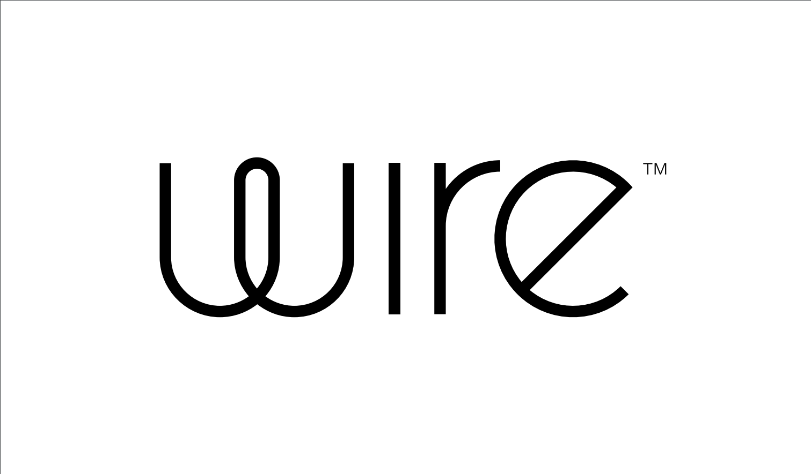

build-lists: true
theme: Ostrich, 3
slide-transition: true
slidenumbers: true
footer: `💻 github.com/ChrisPenner/comonads-by-example | 🐦 @ChrisLPenner | 📝 chrispenner.ca`

^ background-color: #0F0E0E
^ text: #FF5481
^ header: #FF5481
^ text-emphasis: #FFFFFF
^ text-strong: #FF5481
^ code: auto(25)

#[fit] **Comonads**
#[fit] *comonoids in the category of endofunctors*
#[fit] *what's the problem?*

---



`Hiring haskell devs/devops`

`wire.com/jobs`

---

# Outline

```
* Session 1 & 2
    1. Comonads using streams and queries
    2. Store Comonad

* Session 3 & 4
    1. Env Comonad & Comonad Transformers
    2. Traced Comonad
    3. Comonad Fix (Bonus)
```


---

# Get the SRC
### github.com/ChrisPenner/comonads-by-example

```
git clone git@github.com:ChrisPenner/comonads-by-example
cd comonads-by-example
stack build
```

---

#[fit] Monads


---

#[fit] Co-monads


---

#[fit] **Monads**

## [fit] Introduce Effects

---

#[fit] `putStrLn :: String -> IO ( )`

---

#[fit] `readFile :: FilePath -> IO String`

---

#[fit] `words :: String -> [String]`

---

### Effect Construction

#[fit] `find :: (a -> Bool) -> [a] -> Maybe String`

---

#[fit]  **Effects** *
##[fit] _Add a_ Context
##[fit] _To an_ Element

#[fit] `a -> m b`

#### *a.k.a co-algebras

---

###[fit] What about **Co**Effects?

---

#[fit] *Duals*
####[fit] **flip** all the things

---

# **Co**Effects


#[fit] `a -> m b`
#[fit] __`a <- w b`__

---

# **Co**Effects

#[fit] `a -> m b`
#[fit] __`w a -> b`__

---

# [fit] **Co**Effects *
## [fit] are **Queries**
## [fit] over a **Structure**

#### *a.k.a algebras

---

# [fit] `length :: [a] -> Int`

---

# [fit] `head :: [a] -> a`

---

### Query Construction
# [fit] `elem :: a -> ([a] -> Bool)`

---

# [fit] `fst :: (a, b) -> a`
# ` `
# [fit] `snd :: (a, b) -> b`

---

# [fit] `sum :: Tree Int -> Int`

---

# [fit] **Monads** _let us_
# [fit] compose **effects**

---

#[fit] Monads
###[fit] are a **context**
###[fit] where we can introduce **effects**

---

#[fit] **Co**monads
###[fit] are a **context**
###[fit] where we can run **queries**

---

#[fit] _Confusing?_

##[fit] _let's add some_ **context**

---


#[fit] Let's look at a specific **context**
#[fit] `  `
#[fit] `  `
#[fit] `data Stream a = a :> Stream a`


---


```haskell
data Stream a = a :> Stream a
       deriving (Functor, Foldable)
```

####  `:>` is an **infix** data constructor

---

# Helpers

```haskell
fromList :: [a] -> Stream a
fromList xs = go (cycle xs)
  where
    go (a:rest) = a :> go rest

countStream :: Stream Int
countStream = fromList [0..]
λ> 0 :> 1 :> 2 :> 3 :> 4 :> ...
```

---

# Let's write some 
##[fit] **Queries**

a.k.a. **Co**Effects[^**]

[^**]: a.k.a. algebras

---

#[fit]`ix :: Int -> Stream a -> a`

---

```haskell
ix :: Int -> Stream a -> a
ix n _ | n < 0 = error "whoops"
ix 0 (a :> _) = a
ix n (_ :> rest) = ix (n - 1) rest
```

---

```haskell
λ> countStream
0 :> 1 :> 2 :> 3 :> 4 :> ...

λ> ix 0 countStream
0

λ> ix 2 countStream
2

λ> ix 1337 countStream
1337
```

---


---

# [fit] **So What??**

---

#[fit] Now we want to write **drop**!

##[fit] `dropS :: Int -> Stream a -> Stream a`

---

## Desired Behaviour

```haskell
λ> countStream
0 :> 1 :> 2 :> 3 :> 4 :> ...

λ> dropS 1 countStream
1 :> 2 :> 3 :> 4 :> 5 :> ...

λ> dropS 2 countStream
2 :> 3 :> 4 :> 5 :> 6 :> ...
```

---

#[fit] `Stream a -> Stream b`
### is a 
# **Mutation**

---

# Other **Mutations**

---

#[fit] `gaussianBlur :: Image Pixel -> Image Pixel`

---

#[fit] `followPath :: [e] -> Graph e v -> Graph e v`

---

#[fit] `scanl1 :: (a -> a -> a) -> [a] -> [a]`

---

#[fit] `popHeap_ :: Heap Int -> Heap Int`

---


#[fit] `deleteColumn :: SpreadSheet a -> SpreadSheet a`


---


# [fit]`derivative :: (Double -> Double) -> (Double -> Double)`


---

# Also

* Solve Hill Climbing Problems
* Compute Roots using Newton's Method
* Compute dependency trees
* Crush the Coding Interview (Rainwater Problem)

---

#[fit] **Where** were we?

---

```haskell
have:
λ> ix 2 countStream
2

want:
λ> dropS 2 countStream
2 :> 3 :> 4 :> 5 :> 6 :> ...
```

---

## **Similar??**

```haskell
ix    :: Int -> Stream a ->        a

dropS :: Int -> Stream a -> Stream a
```

---


### Can we turn a
#[fit]**query** 
### into a 
#[fit]**mutation**?

---

# [fit] Back 
### _to the_
#[fit] **Monad**

---

#[fit]  **join**

---

# [fit] `join :: m (m a) -> m a`

---

# [fit] `join :: m (m a) -> m a`
# [fit] **`cojoin?? :: w a -> w (w a)`**

---

# **WTH**
## _is_
#[fit] **Co**Join?

---

# [fit] `duplicate :: w a -> w (w a)`

---

# WUT?

---

# _Duplicate_
#[fit] **Nests** your **Structure**
### while maintaining
#[fit] **Context**
#### _*we'll talk about laws later_

---

# [fit] The **Context** of a **Stream** 
## is its
# [fit] __*position*__

---

# [fit] `duplicate :: Stream a -> Stream (Stream a)`

---


### `stream`

### `duplicate stream`


---

```haskell
λ> countStream
0 :> 1 :> 2 :> 3 :> 4 :> ...

λ> duplicate countStream
   (0 :> 1 :> 2 :> ...) -- The original stream
:> (1 :> 2 :> 3 :> ...) -- The stream viewed from the second element
:> (2 :> 3 :> 4 :> ...) -- The stream viewed from the third element
:> ...                  -- Continue ad nauseam...
```

---

##[fit] *Duplicate*
### shows us all possible 
##[fit]**views**
### of a **structure**

---

##[fit] Each **View**
### appears in a
#[fit] **slot**
### according to _some_ Intuition
#### * _and some laws which I promise we'll talk about real soon_

---

# Think about each **slot**

```haskell
λ> countStream
1 :> 2 :> 3 :> 4 :> 5 :> ...

λ> duplicate countStream
   (1 :> 2 :> 3 :> ...) -- The original stream
:> (2 :> 3 :> 4 :> ...) -- The stream viewed from the second element
:> (3 :> 4 :> 5 :> ...) -- The stream viewed from the third element
:> ...                  -- Continue ad nauseam...
```

---


---

##[fit] **_ix_** _focuses a_
# **slot**
## _within the_ **structure**

---

#[fit] **duplicate**
### fills each 
#[fit] **slot**
### with a copy of the _s t r e a m_
### **viewed** from that position

---

##[fit] So if **duplicating** gets us all the **views**
### and
##[fit] _ix_ can **select** one of those **views**
##[fit] then...

---

#[fit] **`ix`**
#[fit] _+_
#[fit] **`duplicate`**
#[fit] _=_
#[fit] **`dropS`**

---


```haskell
λ> duplicate countStream
   (1 :> 2 :> 3 :> ...) -- The original stream
:> (2 :> 3 :> 4 :> ...) -- The stream viewed from the second element
:> (3 :> 4 :> 5 :> ...) -- The stream viewed from the third element
:> ...                  -- Continue ad nauseam...

λ> ix 2 (duplicate countStream)
2 :> 3 :> 4 :> 5 :> 6 :> ...

λ> ix 42 (duplicate countStream)
42 :> 43 :> 44 :> 45 :> 46 :> ...
```

---

#[fit] **Duplicate**
### helps us lift a
#[fit] **Query**
### into a
#[fit] **Mutation**

---

# `dropS`

```haskell
dropS :: Int -> Stream a -> Stream a
dropS n s = ix n (duplicate s)
```

####_error handling is for nerds_ 🤓

---

#[fit] **_COOL_** _COOL_ **_COOL_**

##[fit] Questions?

---

##[fit] Anything you want to 
##[fit]**try**?

---


---

# Can we go 
# **back**?


---

### Can we turn a 
#[fit] **mutation**
### into a 
#[fit] **query**?

---

can we use this:
#[fit]`dropS :: Int -> Stream a -> Stream a`
to implement this:
#[fit]`ix    :: Int -> Stream a ->        a`
??

---

#[fit]`dropS :: Int -> Stream a -> Stream a`
#[fit]`ix    :: Int -> Stream a ->        a`

---


```haskell
λ> dropS 1 countStream          λ> ix 1 countStream
1 :> 2 :> 3 :> 4 :> 5 :> ...    1
^

λ> dropS 2 countStream          λ> ix 2 countStream
2 :> 3 :> 4 :> 5 :> 6 :> ...    2
^
```

---

#[fit] `ix n s = ix 0 (dropS n s)`

#### * but infinite loops make me sad 😭

---

#[fit] `ix 0`
### is **special**

---

## It 
#[fit] **extracts**
## the 
#[fit]**focused** **slot**

---

#[fit] `extract :: Stream a -> a`

---

# #ez-pz 🍋  squeezy

```haskell
extract :: Stream a -> a
extract (a :> _) = a
```

#[fit] `extract == ix 0`

---

#[fit] **Extract**
### is the
#[fit] *null/no-op*
#[fit] **query**

#### _*laws are seriously coming up I swear_

---

#[fit] `ix n s = extract (dropS n s)`

---

##[fit]👨‍⚖️ Laws 👩‍⚖️

---

##[fit] The **original view** of the structure 
##[fit] must be stored in **focused slot**
###[fit] when **duplicating**

#[fit] `extract (duplicate w) == w`

---

##[fit] The **focused slot** of each **view**
###[fit] must match the **slot** it's stored in
### after **duplicating**

#[fit] `extract <$> duplicate w == w`

---

#[fit] `duplicate (duplicate w)`
# `==`
#[fit] `duplicate <$> duplicate w`

---

# **COMONADS**

---

```haskell
class Functor w => Comonad w where
  extract   :: w a -> a
  duplicate :: w a -> w (w a)
  extend    :: (w a -> b) -> w a -> w b
{-# MINIMAL extract, (duplicate | extend) #-}
```

#### * extend lifts from a __query__ to a __mutation__

---

#[fit] **Comonads**
### are 
#[fit] **structures**
### or
#[fit]**spaces**

---

### that we can 
#[fit] **view** 
### from different 
#[fit] **focuses**

---

### The 
#[fit] **view**
### can be
#[fit] _incomplete_

#### *_some elements may be missing from some views_

---


#[fit] Trees

#[fit]  nodes _are the_ **slots**
#[fit] **views** _are_ subtrees
#[fit] **extract** _the_ subtree's root

---

#[fit] Spreadsheets

#[fit]  cells _are the_ **slots**
#[fit] **views** _are_ relative
#[fit] **extract** _the_ focused cell


---

#[fit] Non-Empty Lists

#[fit]  elements _are the_ **slots**
#[fit] **views** _are_ list tails
#[fit] **extract** _the_ head of the list


---

#[fit] Zippers

#[fit]  elements _are the_ **slots**
#[fit] **views** _are_ doubly linked lists
#[fit] **extract** _the_ focus of the doubly linked list


---

#[fit] Functions

### *when paired with an X-value

#[fit]  x-axis positions _are the_ **slots**
#[fit] **views** _are relative to your_ x
#[fit] **extract** _the_ Y _at your_ X


---

#[fit] _NOT_
#[fit] **Comonads**

---

#[fit] Lists

#[fit] Can't always **extract**

---

#[fit] Functions

### *_when_ not _paired with an_ X-value

#[fit] _which_ Y _do we_ **extract**?

---

#[fit] `IO`

#[fit] Can't get values **OUT**

---

#[fit] Maybe / Either

### Can't always **extract**

---

# Quiz Me
## Is it a **comonad**??

---

#[fit] _Let's_
#[fit] **lift**
#[fit] _another_
#[fit] **query**

---

#[fit] `takeS :: Int -> Stream a -> [a]`

---

## _A_ **_relative_** **query**
### Which takes the next _n_ slots
### from the current **view**

#[fit] `takeS :: Int -> Stream a -> [a]`

---


[.code-highlight: 1-2]
[.code-highlight: all]
```haskell
takeS :: Int -> Stream a -> [a]
takeS n input = take n (toList input)

λ> countStream
0 :> 1 :> 2 :> 3 :> 4 :> ...

λ> takeS 3 countStream
[0,1,2]
```


---

#[fit] **Extend**
### _lifts_
#[fit] **Queries**
### into
#[fit] **mutations**

---

# **Extend**

### runs a **query**
### over each **slot's** **view**

---

```haskell
λ> countStream
0 :> 1 :> 2 :> 3 :> 4 :> ...

λ> takeS 3 countStream
[0,1,2]

λ> extend (takeS 3) countStream
   [0,1,2] 
:> [1,2,3] 
:> [2,3,4] 
:> [3,4,5] 
:> [4,5,6] 
:> ...
```

---

# Challenge

Compute a rolling average over a stream of integers

```haskell
rollingAvg :: Int           -- Window Size
           -> Stream Int    -- Input Stream
           -> Stream Double -- Stream of averages
```

---


E.g. `rollingAvg 2`


[.code-highlight: 1-2]
[.code-highlight: 1-5]
[.code-highlight: all]
```haskell
λ> evens
0 :> 2 :> 4 :> 6 :> ...

λ> rollingAvg 2 evens
(0 + 2) / 2 :> (2 + 4) / 2 :> (4 + 6) / 2 :>  ...
-- reduces to
1 :> 3 :> 5 :> 7 :> ...
```

---

#[fit] The **type** tells us 

```haskell
rollingAvg :: Int           -- Window Size
           -> Stream Int    -- Input Stream
           -> Stream Double -- Stream of averages
```
#[fit] it's a **Mutation**

---

#[fit]**BUT**

## **Mutations** are _Hard_

---

#[fit] Why average _EVERY_ **slot**

#[fit] When we can just lift a 
# **query**?

---

# Query version

```haskell
windowedAvg :: Int -> Stream Int -> Double
windowedAvg windowSize = avg . takeS windowSize
  where
    avg :: [Int] -> Double
    avg xs =
        fromIntegral (sum xs)
        / fromIntegral (length xs)
```

---

```haskell
windowedAvg :: Int -> Stream Int ->       Double

rollingAvg  :: Int -> Stream Int -> Stream Double
```

---

## A **rolling average**
## is just a 
## **windowed average**
## at every **view**

---


```haskell
λ> countStream
0 :> 1 :> 2 :> 3 :> 4 :> ...

λ> extend (windowedAvg 2) countStream
0.5 :> 1.5 :> 2.5 :> 3.5 :> 4.5 :> ...

λ> extend (windowedAvg 3) countStream
1.0 :> 2.0 :> 3.0 :> 4.0 :> 5.0 :> ...
```

---

#[fit] Challenge: Implement Comonad for Stream

```haskell
data Stream a = a :> Stream a
       deriving (Functor, Foldable)

instance Comonad Stream where
  extract :: Stream a -> a

  duplicate :: Stream a -> Stream (Stream a)

  extend :: (Stream a -> b) -> Stream a -> Stream b
```

---

```haskell
instance Comonad Stream where
  extract :: Stream a -> a
  extract (a :> _) = a

  duplicate :: Stream a -> Stream (Stream a)
  duplicate s@(_ :> rest) = s :> duplicate rest

  extend :: (Stream a -> b) -> Stream a -> Stream b
  extend f s@(_ :> rest) = f s :> extend f rest
  -- OR
  extend f s = f <$> duplicate s
```
