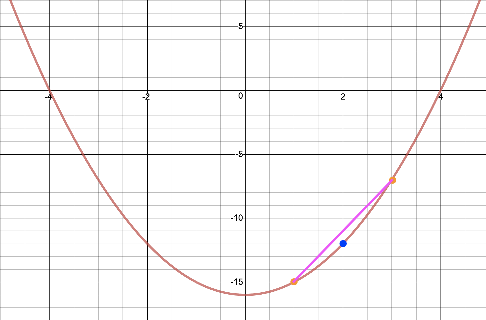

build-lists: true
theme: Ostrich, 3
slide-transition: true
slidenumbers: true
footer: `💻 github.com/ChrisPenner/comonads-by-example | 🐦 @ChrisLPenner | 📝 chrispenner.ca`

^ background-color: #0F0E0E
^ text: #FF5481
^ header: #FF5481
^ text-emphasis: #FFFFFF
^ text-strong: #FF5481
^ code: auto(25)

#[fit] **Traced**

#[fit] a.k.a. Co-Writer
##[fit] `a.k.a. Monoid m => m -> a`

---

#[fit] `newtype Traced m a = Traced (m -> a) `

---

#[fit] a **function**
## where the argument
#[fit] is a **Monoid**

---

#[fit] Traced is a **query**
#[fit] By Itself

---

#[fit]`sum :: [ Int ] -> Int`

---

#[fit]`length :: [ Int ] -> Int`

---

#[fit]`??? :: Map String Int -> Int`

---

#[fit]`??? :: Set a - > Int`


---

#[fit] **Traced**
#[fit] is like **store**
### but all **positions**
#[fit] are **Relative**

---

# Traced

```haskell
extract :: Traced m a -> a
extract (Traced f) = f mempty
```

---

#[fit] **`m -> a`**
#[fit] is only a comonad
#[fit] when _m_ is a Monoid

---

#[fit] Traced
#[fit] **Queries**

---

#[fit] Trace
#[fit] **applies** the function 
#[fit] to an argument

---

# Trace

#[fit] `trace :: m -> Traced m a -> a`

---

```haskell
λ> :t sum
sum :: [Int] -> Int

λ> let adder = Traced sum
adder :: Traced [Int] Int

λ> extract adder
0

λ> trace [1,2,3] adder
6
```

---

#[fit] Extending Trace
#[fit] **bakes in**
#[fit] arguments

---


```haskell
λ> let adder' = adder =>> trace [1,2,3]
adder :: Traced [Int] Int

λ> extract adder'
6

λ> trace [10] adder'
16
```

---

```haskell
λ> let builder = traced concat
builder :: Traced [String] -> String

e
```

---

# Traced

```haskell
duplicate :: Traced m a 
          -> Traced m (Traced m a)
duplicate (Traced f) =
    Traced $ \m -> Traced (f . mappend m)
```

---
# Traced

```haskell
extend :: (Traced m a -> b) 
       -> Traced m a 
       -> Traced m b
extend g = fmap g . duplicate
```

---

# Traced

```haskell
trace :: m -> Traced m a -> a
trace m (Traced f) = f m

times10 :: Traced (Sum Int) Int
times10 = traced (\(Sum n) -> n * 10 )

λ> extract times10
0
λ> trace (Sum 5) times10
50
λ> extract $ times10 =>> trace (Sum 1) =>> trace (Sum 2)
30
```

---

# EQUATIONAL REASONING

[.code-highlight: 1]
[.code-highlight: 1-3]
[.code-highlight: all]
```haskell
uppercase :: String -> String
uppercase = fmap toUpper
> trace "hi" (Traced uppercase)
-- definition of 'trace'
> uppercase "hi"
-- apply uppercase
> "HI"
```

---


[.code-highlight: 1]
[.code-highlight: 1-3]
[.code-highlight: 1-5]
[.code-highlight: 1-7]
[.code-highlight: 1-9]
[.code-highlight: all]
```haskell
> Traced uppercase =>> trace "hi"
-- definition of =>>
> trace "hi" <$> (duplicate $ Traced uppercase) 
-- definition of duplicate
> trace "hi" <$> (Traced $ \m -> Traced (uppercase . mappend m)) 
-- apply <$>
> Traced $ \m -> trace "hi" (Traced (uppercase . mappend m))
-- apply 'trace'
> Traced $ \m -> (uppercase . mappend m) "hi" 
```

---

[.code-highlight: 1]
[.code-highlight: 1-3]
[.code-highlight: 1-5]
[.code-highlight: 1-7]
[.code-highlight: 1-9]
[.code-highlight: all]
```haskell
> extract $ Traced id =>> trace "hi" =>> trace "!!"
-- Apply previous substitutions
> extract $ Traced (\m -> (uppercase . mappend m) "hi") =>> trace "!!"
-- Cancel 'extract' with =>>
> trace "!!" (Traced $ \m -> (uppercase . mappend m) "hi")
-- Apply 'trace'
> (\m -> (uppercase . mappend m) "hi") "!!" 
-- Lambda substitution
> (uppercase . mappend "!!") "hi"
-- Apply mappend
> "!!HI"
```

---

# Traced Example

```haskell
exclamation :: Traced String String
exclamation = traced (\s -> uppercase (s <> "!!"))

λ> trace "hello" exclamation
"HELLO!!"
λ> extract $ exclamation =>> trace "hello"
"HELLO!!"
λ> extract $ exclamation =>> trace "jerry" =>> trace " " =>> trace "hello"
"HELLO JERRY!!"
```

---

# Listen

[.code-highlight: 1-2]
[.code-highlight: 1-5]
[.code-highlight: 1-8]
[.code-highlight: all]

```haskell
listen :: Traced m a -> Traced m (a, m)
listen (Traced f) = Traced $ \m -> (f m, m)

t :: Traced [String] String
t = traced (intercalate " AND A ")

λ> trace ["one", "two"] $ listen t
("one AND A two",["one","two"])
λ> extract $ listen t =>> trace ["one"] =>> trace ["two"]
("two AND A one",["two","one"])
λ> extract $ listen (t =>> trace ["one"] =>> trace ["two"])
("two AND A one",[])
```

---

# Traces

[.code-highlight: 1-2]
[.code-highlight: 1-5]
[.code-highlight: 1-10]
[.code-highlight: 1-13]
[.code-highlight: all]

```haskell
traces :: Monoid m => (a -> m) -> Traced m a -> a
traces f t = trace (f (extract t)) t

t :: Traced (Sum Int) Ordering
t = traced (\m -> compare m 10)

homeIn :: Ordering -> Sum Int
homeIn GT = Sum (-1)
homeIn LT = Sum 1
homeIn EQ = Sum 0

λ> trace 12 $ listen t =>> traces (homeIn . fst) =>> traces (homeIn . fst)
(EQ,Sum {getSum = 11})

λ> trace 12 $ listen t =>> traces (homeIn . fst) =>> traces (homeIn . fst) =>> traces (homeIn . fst)
(EQ,Sum {getSum = 10})
```


---

# Traced Intuition

| **extract:** | Run the computation at my current location | 
| ---: | :--- |
| **extend:** | move to another location (relative) |
| **trace** | What value is at this place near me? |
| **traces** | Given the value at my location; decide which nearby value to look at |

---

# [fit] Questions**?**

---


# Example: Function Derivative


---

$$
x^2 - 16
$$


---


---


```haskell
rootSolver :: Double -> Traced (Sum Double) Double
rootSolver n = Traced f
  where
    f :: Sum Double -> Double
    f (Sum x) = (x^2) - n
```

---

$$
x = 2 
$$


---


---


---



---


---


---

# Live Coding?

---

```haskell
solveRoot16 :: Double -> Double
solveRoot16 x = (x ^ (2 :: Integer)) - 16

solveRoot16T :: Traced (Sum Double) Double
solveRoot16T  = traced (solveRoot16 . getSum)
```

---

```haskell
estimateDerivativeAtPosition :: Traced (Sum Double) Double
                             -> Double
estimateDerivativeAtPosition w =
    let leftY = trace (Sum (-1)) w
        rightY = trace (Sum 1) w
     in (rightY - leftY) / 2
```

---

```haskell
estimateDerivativeAtPositionReader :: Traced (Sum Double) Double
                             -> Double
estimateDerivativeAtPositionReader = do
    leftY <- trace (Sum (-1))
    rightY <- trace (Sum 1)
    return $ (rightY - leftY) / 2
```

---

```haskell
estimateDerivative :: Traced (Sum Double) Double
                   -> Traced (Sum Double) Double
estimateDerivative = extend estimateDerivativeAtPosition
```

---

```haskell
withDerivative :: Traced (Sum Double) (Double, Double)
withDerivative = liftW2 (,) solveRoot16T (estimateDerivative solveRoot16T)
```

---

```haskell
λ> extract withDerivative
(-16.0,0.0)

λ> trace (Sum 0) withDerivative
(-16.0,0.0)

λ> trace (Sum 1) withDerivative
(-15.0,2.0)

λ> trace (Sum 4) withDerivative
(0.0,8.0)
```

---

# Example: Dependency Tracking

```haskell
ingredientsOf :: String -> S.Set String
ingredientsOf "string"  = S.fromList ["wool"]
ingredientsOf "sticks"  = S.fromList ["wood"]
ingredientsOf "bow"     = S.fromList ["sticks", "string"]
ingredientsOf "arrow"   = S.fromList ["sticks", "feather", "stone"]
ingredientsOf "quiver"  = S.fromList ["arrow", "bow"]
ingredientsOf "torches" = S.fromList ["coal", "sticks"]
ingredientsOf _         = mempty

recipes :: Traced (S.Set String) (S.Set String)
recipes = traced (foldMap ingredientsOf)
```

---

```haskell
string  -> wool
sticks  -> wood
bow     -> sticks, string
arrow   -> sticks, feather, stone
quiver  -> arrow, bow
torches -> coal, sticks
```

[.code-highlight: 1-3]
[.code-highlight: 1-6]
[.code-highlight: all]
```haskell
λ> trace ["string"] recipes
fromList ["wool"]

λ> trace ["string", "torches"] recipes
fromList ["coal","sticks","wool"]

λ> extract $ recipes =>> trace ["torches"]
fromList ["coal","sticks"]
```

---

```haskell
string  -> wool
sticks  -> wood
bow     -> sticks, string
arrow   -> sticks, feather, stone
quiver  -> arrow, bow
torches -> coal, sticks
```

[.code-highlight: 1-3]
[.code-highlight: 1-6]
[.code-highlight: all]

```haskell
λ> trace ["quiver"] $ recipes
fromList ["arrows","bow"]

λ> trace ["quiver"] $ recipes =>> traces id
fromList ["arrows","bow","feathers","sticks","stone","string"]

λ> trace ["quiver"] $ recipes =>> traces id =>> traces id
fromList ["arrows","bow","feathers","sticks","stone","string","wood","wool"]
```

---


---


---


--- 

# [fit] Questions**?**
