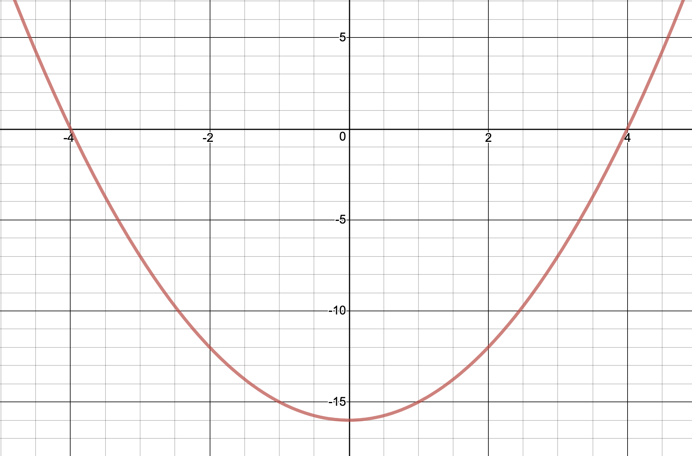
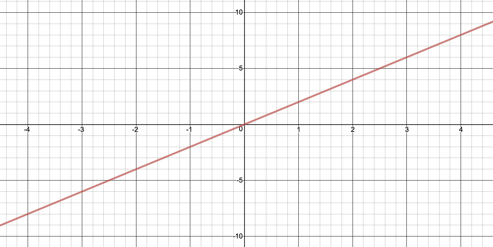

build-lists: true
theme: Ostrich, 3
slide-transition: true
slidenumbers: true
footer: `💻 github.com/ChrisPenner/comonads-by-example | 🐦 @ChrisLPenner | 📝 chrispenner.ca`

^ background-color: #0F0E0E
^ text: #FF5481
^ header: #FF5481
^ text-emphasis: #FFFFFF
^ text-strong: #FF5481
^ code: auto(25)

#[fit] **Traced**

#[fit] a.k.a. Co-Writer
##[fit] `a.k.a. Monoid m => m -> a`

---

#[fit] `newtype Traced m a = Traced (m -> a) `

---

#[fit] a **function**
## where the argument
#[fit] is a **Monoid**

---

#[fit] Traced is a **query**
#[fit] By Itself

---

#[fit]`sum :: [ Int ] -> Int`

---

#[fit]`length :: [ Int ] -> Int`

---

#[fit]`??? :: Map String Int -> Int`

---

#[fit]`??? :: Set a - > Int`


---

#[fit] **Traced**
#[fit] is like **store**
### but all **positions**
#[fit] are **Relative**

---

#[fit] **`m -> a`**
#[fit] is only a comonad
#[fit] when _m_ is a Monoid

---

#[fit] Traced
#[fit] **Queries**

---

```haskell
extract :: Traced m a -> a
extract (Traced f) = f mempty
```

---

```haskell
λ> :t sum
sum :: [Int] -> Int

λ> let adder = traced sum
adder :: Traced [Int] Int

λ> extract adder -- a.k.. sum []
0
```

---


#[fit] Trace
#[fit] **applies** the function 
#[fit] to an argument

---

# Trace

#[fit] `trace :: m -> Traced m a -> a`

---

```haskell
λ> trace [1,2,3] adder -- a.k.a. sum [1,2,3]
6
```

---

#[fit] Extending Trace
#[fit] **bakes in**
#[fit] arguments

---


```haskell
λ> let adder' = adder =>> trace [1,2,3]
adder' :: Traced [Int] Int

λ> extract adder' -- a.k.a. sum (mempty <> [1,2,3])
6

λ> trace [10] adder' -- a.k.a. sum ([10] <> [1,2,3])
16
```

---

```haskell
newBuilder :: Traced [String] String
newBuilder = traced concat

logMsg :: Traced [String] String -> String
logMsg = trace ["hello "] =>= trace ["world"]

-- Uh Oh!
-- λ> logMsg newBuilder
-- "worldhello "
```

---

#[fit] Trace always
#[fit] **prepends**
#[fit] new elements

---

# [fit] Questions**?**

---

#[fit] Traced

#[fit] Your position is **implicit**
#[fit] **trace** moves relatively
#[fit] you can look **nearby** 
#[fit] extending **trace** moves you


---

# Example: Function Derivative



---

# A derivative is a **contextual** calculation

---

## The derivative at a given point is dependant on 
## the **nearby** values

---

# We can roughly **estimate**

$$
f'(x) = \frac{f(x + 1) - f(x - 1)}{2}
$$


---

$$
x^2 - 16
$$


---


---

$$
x = 2 
$$


---


---


---


---



---

```haskell
-- Solution for the sqrt of 16
func :: Sum Double -> Double
func (Sum x) = (x ^ (2 :: Integer)) - 16

f :: Traced (Sum Double) Double
f  = traced func
```

---

```haskell
λ> extract f -- f (Sum 0)
-16.0
λ> trace (Sum 2) f
-12.0
λ> trace (Sum 6) f
20.0
λ> trace (Sum 4) f
0.0
```

---

#[fit] We can write a **query**
### to estimate `f'`
#[fit] at a single position

---

#[fit] `estimateDerivative`
#[fit] `:: Traced (Sum Double) Double -> Double`

---

```haskell
estimateDerivative :: Traced (Sum Double) Double
                   -> Double
estimateDerivative w =
    let leftY = trace (Sum (-1)) w
        rightY = trace (Sum 1) w
     in (rightY - leftY) / 2
```

---

```haskell
estimateDerivativeReader :: Traced (Sum Double) Double
                         -> Double
estimateDerivativeReader = do
    leftY <- trace (Sum (-1))
    rightY <- trace (Sum 1)
    return $ (rightY - leftY) / 2
```

---

#[fit] If we estimate `f'`
#[fit] at **ALL** positions
#[fit] We estimate the whole function!

---

```haskell
estimateDerivative :: Traced (Sum Double) Double
                   -> Traced (Sum Double) Double
estimateDerivative = extend estimateDerivativeAtPosition
```

---

#[fit] Comonads have **`liftW2`**
#[fit] like `liftA2`
#[fit] But always **zippy**


---

#[fit] If a **Comonad**
#[fit] is also **Applicative**
#[fit] `liftW2 == liftA2`

---

```haskell
withDerivative :: Traced (Sum Double) (Double, Double)
withDerivative = liftW2 (,) f (estimateDerivative f)
```

---

```haskell
λ> extract withDerivative
(-16.0, 0.0)

λ> trace (Sum 0) withDerivative
(-16.0, 0.0)

λ> trace (Sum 1) withDerivative
(-15.0, 2.0)

λ> trace (Sum 4) withDerivative
(0.0, 8.0)
```


---

# Traced

```haskell
duplicate :: Traced m a 
          -> Traced m (Traced m a)
duplicate (Traced f) =
    Traced $ \m -> Traced (f . mappend m)
```

---
# Traced

```haskell
extend :: (Traced m a -> b) 
       -> Traced m a 
       -> Traced m b
extend g = fmap g . duplicate
```

---

# Listen

[.code-highlight: 1-2]
[.code-highlight: 1-5]
[.code-highlight: 1-8]
[.code-highlight: all]

```haskell
listen :: Traced m a -> Traced m (a, m)
listen (Traced f) = Traced $ \m -> (f m, m)

t :: Traced [String] String
t = traced (intercalate " AND A ")

λ> trace ["one", "two"] $ listen t
("one AND A two",["one","two"])
λ> extract $ listen t =>> trace ["one"] =>> trace ["two"]
("two AND A one",["two","one"])
λ> extract $ listen (t =>> trace ["one"] =>> trace ["two"])
("two AND A one",[])
```

---

# [fit] Questions**?**

---

#[fit] Dependency Tracking

---


---

```haskell
ingredientsOf :: String -> S.Set String
ingredientsOf "string"  = S.fromList ["wool"]
ingredientsOf "sticks"  = S.fromList ["wood"]
ingredientsOf "bow"     = S.fromList ["sticks", "string"]
ingredientsOf "arrow"   = S.fromList ["sticks", "feather", "stone"]
ingredientsOf "quiver"  = S.fromList ["arrow", "bow"]
ingredientsOf "torches" = S.fromList ["coal", "sticks"]
-- Everything else has no dependencies
ingredientsOf _         = mempty

recipes :: Traced (S.Set String) (S.Set String)
recipes = traced (foldMap ingredientsOf)
```

---

```haskell
quiver  -> arrow, bow
arrow   -> sticks, feather, stone
bow     -> sticks, string
torches -> coal, sticks
sticks  -> wood
string  -> wool
```

[.code-highlight: 1-3]
[.code-highlight: 1-6]
[.code-highlight: all]
```haskell
λ> trace ["string"] recipes
fromList ["wool"]

λ> trace ["string", "torches"] recipes
fromList ["coal","sticks","wool"]

λ> recipes =>> trace ["torches"]
fromList ["coal","sticks"]

λ> recipes & (trace ["string", "torches"] =>= trace ["sticks"])
fromList ["coal","sticks","wood","wool"]
```

---

```haskell
quiver  -> arrow, bow
arrow   -> sticks, feather, stone
bow     -> sticks, string
torches -> coal, sticks
sticks  -> wood
string  -> wool
```

[.code-highlight: 1-3]
[.code-highlight: 1-6]
[.code-highlight: all]

```haskell
λ> trace ["quiver"] $ recipes
fromList ["arrows","bow"]

λ> trace ["quiver"] $ recipes =>> traces id
fromList ["arrows","bow","feathers","sticks","stone","string"]

λ> trace ["quiver"] $ recipes =>> traces id =>> traces id
fromList ["arrows","bow","feathers","sticks","stone","string","wood","wool"]
```

---


---


---


--- 

# [fit] Questions**?**
