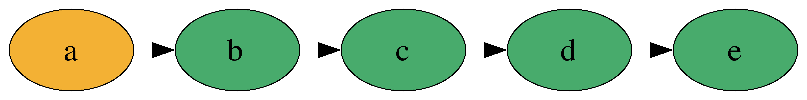
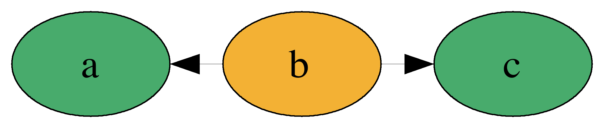
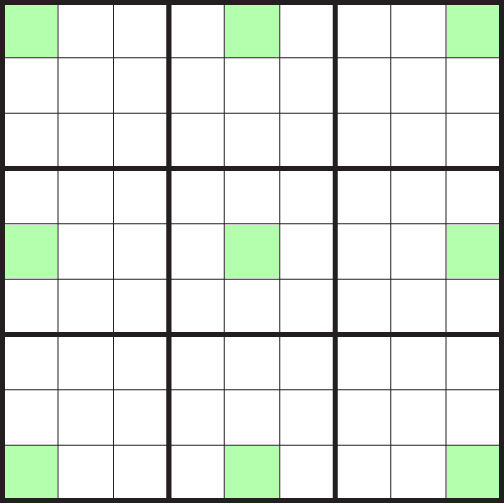

build-lists: true
theme: Ostrich, 3
slide-transition: true

^ background-color: #0F0E0E
^ text: #FF5481
^ header: #FF5481
^ text-emphasis: #FFFFFF
^ text-strong: #FF5481
^ code: auto(25)

#[fit]**_BYOZ_**

Build Your Own Zipper

---

```haskell
data Zipper a =
  Zipper
    { left :: [a]
    , focus :: a
    , right :: [a]
    } deriving (Show, Eq, Functor, Foldable)
```

---

[.code-highlight: 1-2]
[.code-highlight: 4-5]
[.code-highlight: all]
```haskell
λ> let z = fromList ['a', 'b', 'c', 'd', 'e']
Zipper []  'a' ['b', 'c', 'd', 'e']

λ> moveRight' z
Zipper ['a'] 'b' ['c', 'd', 'e']

λ> moveRight' . moveRight' $ z
Zipper ['b', 'a'] 'c' ['d', 'e']
```


---

```haskell
Zipper ['b', 'a'] 'c' ['d', 'e']
```


```haskell
Zipper ['a'] 'b' ['c', 'd', 'e']
```


---




```haskell
Zipper [] 'a' ['b', 'c', 'd', 'e']
```
---

```haskell
Zipper { left = ['a'] , focus = 'b' , right = ['c'] }
```



---

# Move Right


---

# Move Right

```haskell
moveRight :: Zipper a -> Maybe (Zipper a)
moveRight (Zipper ls c (r : rs)) = Just $ Zipper (c : ls) r rs
moveRight _                      = Nothing
```

[.code-highlight: 1-2]
[.code-highlight: 1-4]
[.code-highlight: 1-6]
[.code-highlight: all]
```haskell
λ> z
Zipper {left = "", focus = 'a', right = "bcde"}
λ> moveLeft z
Nothing
λ> moveRight z
Just (Zipper {left = "a", focus = 'b', right = "cde"})
λ> moveRight z >>= moveRight
Just (Zipper {left = "ba", focus = 'c', right = "de"})
```

---

# Move Left

```haskell
moveLeft :: Zipper a -> Maybe (Zipper a)
moveLeft (Zipper (l : ls) c rs) = Just $ Zipper ls l (c : rs)
moveLeft _                      = Nothing
```

---

# Duplicate


---


---


[.code-highlight: 1-2]
[.code-highlight: 1-2, 4]
[.code-highlight: 1-2, 6-12]
[.code-highlight: 1-2, 13-17]
[.code-highlight: 1-2, 18-24]
[.code-highlight: all]
```haskell
λ> z
Zipper {left = "a", focus = 'b', right = "c"}

λ> duplicate z
Zipper
    { left =
        [ Zipper
            { left = []
            , focus = 'a'
            , right = ['b', 'c' ]
            }
        ]
    , focus = Zipper
        { left = ['a']
        , focus = 'b'
        , right = ['c']
        }
    , right =
        [ Zipper
            { left = ['b', 'a']
            , focus = 'c'
            , right = [] 
            }
        ]
    }
```


---

# Workshop
## Implement Comonad For Zipper

```haskell
instance Comonad Zipper where
  extract :: Zipper a -> a
  duplicate :: Zipper a -> Zipper (Zipper a)
  extend :: (Zipper a -> b) -> Zipper a -> Zipper b
```

---


# Rainwater Problem

---


---

#[fit] **LIVE CODE IT**

### *what could possibly go wrong?*

---


[.code-highlight: 1-3]
[.code-highlight: 1-10]
[.code-highlight: all]
```haskell
problem :: Zipper Int
problem = fromList [2, 0, 4, 2, 3, 2, 1, 2]
-- > Zipper [] 2 [0, 4, 2, 3, 2, 1, 2]

max0 :: [Int] -> Int
max0 [] = 0
max0 xs = maximum xs

waterAtPosition :: Zipper Int -> Int
waterAtPosition (Zipper toLeft current toRight)
  = max 0 (containingWallHeight - current)
  where
    containingWallHeight = min (max0 toLeft) (max0 toRight)

solution :: Zipper Int -> Int
solution z = sum (extend waterAtPosition z)
```

---

[.code-highlight: 1-3]
[.code-highlight: 1-5]
[.code-highlight: 6-10]
[.code-highlight: 11-13]
[.code-highlight: 15-16]
[.code-highlight: all]
```haskell
λ> problem = fromList [2, 0, 4, 2, 3, 2, 1, 2]
Zipper {left = [], focus = 2, right = [0,4,2,3,2,1,2]}

λ> z = moveRight' problem
Zipper {left = [2], focus = 0, right = [4,2,3,2,1,2]}

λ> maxLeft = max0 (left z)
2
λ> maxRight = max0 (right z)
4

λ> tallestNeighbour = min maxLeft maxRight
2

λ> tallestNeighbour - focus z
2

λ> max 0 $ tallestNeighbour - focus z
2
```


---


---

THE END 

---


---

# Grids


---


---



---


---


---


---

```
    #    
    # o #  
# o # # # # o #
# o # # # # # #
- - - - - - - -
2 0 4 2 3 2 1 2
```
